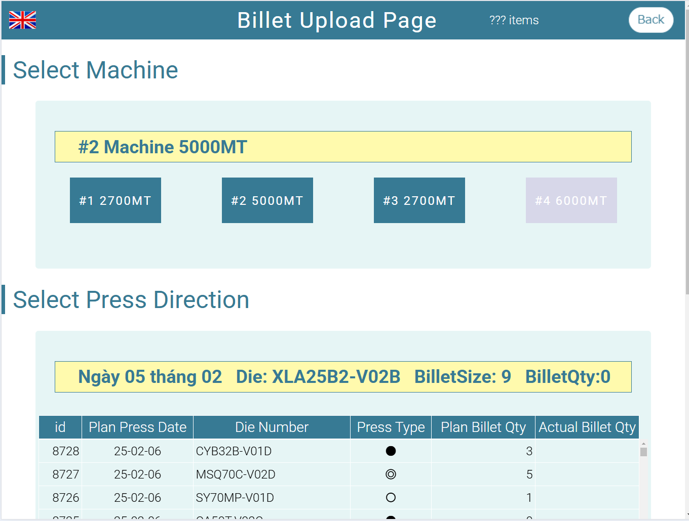

# 2025/02/06

billet charge page 作成。ビレットストック情報。`press directive`からビレットサイズと、長さはデフォルト値として入力した方がいい。その為には、上部の表を読み込んだ際に、その二つの値も読み込んでおいて、表の中に仕込む。表示しない。表の改造をしないと。


デフォルト値をどうやって入れるか、悩む。

# 2025/02/12

どうやって、正しい値を入力したか？確認しやすくする。まずは、選択した PressDirective のマシン番号、インチサイズ、を大きく表示する。これは、完了。ビレットベンダー名を入れるのは、`select`要素。これは完成。一度、ビレットストックに入力を開始したら、他の金型は選べないようにする。または、選んだら、別の設備の、ビレットストックを表示するようにする。つまり、ビレットストックを管理する表が必要になる。

# 2025/02/13

最初に選ぶべきは、設備名。その後、金型を選ぶ。の流れではないか？それとは別にビレットストックのページを作る。

ここまでできた。次は、マシンナンバーによって、押出指示書をフィルタリングして表示する。ここまでは OK。次ビレットストックの表。これを作るのはいいが、いまいち 3 号機の状態が良く分からない。ここは明日相談。

# 2025/02/24

久しぶりに、再構築開始。ビレットストックを追加するときのバリデーションを完成させる。ビレットのロット番号入れるとき、SMC の場合、過去の実績値を出す。その為には、材質も把握しなければならない。PressDirective を選んだ時、ビレットサイズ、材質を引き継ぐ。材質の送信、受領 OK。次は、ビレット番号を選択式にする。サブウィンドウを開いて選択式にしないとだめ。少しめんどくさいので、下に候補を示すテーブルを表示しよう。

# 2025/03/06

`ProductionNumberV3`を使ってみて、以下の問題点。

- 品番修正時、修正モードであるにもかかわらず、'Save'ボタンがアクティブになり、間違えて押してしまう。
- `Update`モードに入っているにもかかわらず、`Update`ボタンがアクティブにならない。
- データを最初に読み込んでいるのか？修正後のデータがリロードしないと反映しない。
- 削除時、削除してもリストが反映しない。
- Delete は独立させた方がいい

# 2025/05/06

金型メンテナンスページを作りたい。index.html はヘッダーと中身を変えたが、これ、読み込み異常がでてタブレットで使えないので、従来の作り方に変更したい。

まずは、今の動きの遅い SQL を作り直す。押出が終わった金型の抽出。100 回分ぐらいあればいいかな？

これがメインテーブルの`SQL`。だいぶややこしい。一か所目のややこしさは、前回金型を洗浄してから、何回目の押出になっているか？だろう。`t_press` から引っ張ってきているが、これは、さすがにベースは、`m_dies`でやるべきではないか？

```SQL
SELECT
    t_press.dies_id,
    m_dies.die_number,
    SUM(CASE WHEN(
                CONCAT(t_press.press_date_at, ' ', DATE_FORMAT(t_press.press_start_at, '%H:%i')) > (
                    SELECT
                        MAX(IFNULL(t_dies_status.do_sth_at, '2000-01-01 00:00')) AS do_sth_date
                    FROM
                        m_dies
                        LEFT JOIN
                            t_dies_status
                        ON  t_dies_status.dies_id = m_dies.id
                    WHERE
                        m_dies.id = t_press.dies_id
                    AND (
                            t_dies_status.die_status_id = 4
                        OR  t_dies_status.die_status_id = 10
                        )
                    GROUP BY
                        m_dies.id
                )
            ) THEN 1 ELSE 0 END) AS is_washed_die,
    CONCAT(t10.die_status, ' ', IFNULL(t10.tank, '')) AS die_status,
    t10.die_status_id,
    SUBSTRING_INDEX(staff_name, ' ', - 1) AS name,
    t10.note,
    DATE_FORMAT(t10.do_sth_at, '%y-%m-%d %H:%i') AS do_sth_at,
    t10.specific_value
FROM
    t_press
    LEFT JOIN
        m_dies
    ON  t_press.dies_id = m_dies.id
    LEFT JOIN
        (
            SELECT
                t_dies_status.dies_id,
                m_die_status.die_status,
                t_dies_status.die_status_id,
                t_dies_status.do_sth_at,
                t_dies_status.note,
                t_dies_status.staff_id,
                m_staff.staff_name,
                t_dies_status.tank,
                t_dies_status.specific_value
            FROM
                t_dies_status
                LEFT JOIN
                    m_die_status
                ON  t_dies_status.die_status_id = m_die_status.id
                LEFT JOIN
                    m_staff
                ON  t_dies_status.staff_id = m_staff.id
                LEFT JOIN
                    (
                        SELECT
                            t_dies_status.dies_id,
                            t_dies_status.die_status_id,
                            MAX(t_dies_status.do_sth_at) AS do_sth_at,
                            t_dies_status.staff_id,
                            t_dies_status.tank
                        FROM
                            t_dies_status
                        GROUP BY
                            t_dies_status.dies_id
                    ) AS t10
                ON  t_dies_status.dies_id = t10.dies_id
                AND t_dies_status.do_sth_at = t10.do_sth_at
            WHERE
                t10.dies_id IS NOT NULL
        ) AS t10
    ON  t10.dies_id = t_press.dies_id
GROUP BY
    dies_id
ORDER BY
    CASE die_status
        WHEN 'Grinding' THEN 9
        WHEN 'Wire cutting' THEN 8
        WHEN 'NG' THEN 7
        WHEN 'NG Rz/Die mark' THEN 6
        WHEN 'NG Kích thước' THEN 5
        WHEN 'Washing' THEN 4
        WHEN 'OK' THEN 3
        WHEN 'Measuring' THEN 2
        WHEN 'On rack' THEN 1
        ELSE 0
    END DESC,
    is_washed_die DESC,
    die_number ASC
;
```

完全ではないが以下である程度コピーできたのではないか？

```SQL
WITH q_last_wash_date AS (
    SELECT
        t_dies_status.dies_id,
        MAX(t_dies_status.do_sth_at) AS last_wash_date
    FROM
        t_dies_status
    WHERE
        t_dies_status.die_status_id = 4
    GROUP BY
        t_dies_status.dies_id
),
press_date_query AS (
    SELECT
        t_press.dies_id,
        CONCAT(t_press.press_date_at, " ", t_press.press_finish_at) AS press_date
    FROM
        t_press
),
press_cnt_query AS (
    SELECT
        q_last_wash_date.dies_id,
        COUNT(press_date_query.dies_id) AS press_cnt
    FROM
        q_last_wash_date
        LEFT JOIN press_date_query
        ON q_last_wash_date.dies_id = press_date_query.dies_id
    WHERE
        q_last_wash_date.last_wash_date < press_date_query.press_date
    GROUP BY q_last_wash_date.dies_id
),
update_info_query AS (
    SELECT
        t1.dies_id,
        DATE_FORMAT(t1.do_sth_at, '%y/%m/%d') AS update_date,
        m_staff.staff_name,
        m_die_status.die_status,
        t1.die_status_id
    FROM t_dies_status AS t1
    LEFT JOIN m_staff
        ON t1.staff_id = m_staff.id
    LEFT JOIN m_die_status
        ON t1.die_status_id = m_die_status.id
    WHERE t1.do_sth_at = (
        SELECT MAX(t2.do_sth_at)
        FROM t_dies_status AS t2
        WHERE t1.dies_id = t2.dies_id
    )
)
SELECT
    m_dies.id,
    m_dies.die_number,
    IFNULL(press_cnt_query.press_cnt, 0) AS press_cnt,
    update_info_query.update_date,
    update_info_query.staff_name,
    ifnull(update_info_query.die_status_id, 0) AS dies_status_id,
    update_info_query.die_status
FROM
    m_dies
LEFT JOIN press_cnt_query
    ON press_cnt_query.dies_id = m_dies.id
LEFT JOIN update_info_query
    ON update_info_query.dies_id = m_dies.id
ORDER BY FIELD(dies_status_id, 4, 2, 10, 8, 0), die_number
```

ただ、これを見ていると、プレスが終わった金型が分からない。on_rack の金型を押出ししたら、on_rack では無いという事。
つまり、金型メンテナンス作業に見合った表示にしていかないとならない。押出が終わっても、洗浄しないで、on_rack した金型は、現状は押出可能になる。でも、押出が終わって、その後、何の情報もない金型は、現場に放置されているという事。まずは、その金型を上位に表示すべきではないか？それとは別に型別に、前回の洗浄から何回押出したかは表示する。
型別の押出日、と型別の最新情報を比較して、押出日以降の記録が無い場合、その金型は洗浄もされていないという事。押出が終わった金型は、洗浄するか、ラックに保管するか？のどちらかを選ぶ。洗浄した金型は、メンテナンスして、ラックに戻す。
では、型別の最終押出日を抽出する`SQL`、、、苦手な奴。以下、完成形

```sql
#########################
# 型別、最終押出日の抽出SQL
SELECT
	t1.id,
	t1.dies_id,
	t1.press_date_at
FROM
	t_press AS t1
WHERE
	concat(t1.press_date_at, " ", t1.press_start_at) = (
		SELECT MAX(CONCAT(t2.press_date_at, " ", t2.press_start_at))
		FROM t_press AS t2
		WHERE t1.dies_id = t2.dies_id
	)
ORDER BY t1.dies_id
;
```

次は、型別の型情報。

```SQl
WITH dies_last_pressed_date_query AS (
	SELECT
		t1.id,
		t1.dies_id,
		t1.press_date_at
	FROM
		t_press AS t1
	WHERE
		concat(t1.press_date_at, " ", t1.press_start_at) = (
			SELECT MAX(CONCAT(t2.press_date_at, " ", t2.press_start_at))
			FROM t_press AS t2
			WHERE t1.dies_id = t2.dies_id
		)
	ORDER BY t1.dies_id
	) , dies_last_status_date_query AS (
	SELECT
		t1.id,
		t1.dies_id,
		t1.do_sth_at
	FROM t_dies_status AS t1
	WHERE t1.do_sth_at = (
		SELECT MAX(t2.do_sth_at)
		FROM t_dies_status AS t2
		WHERE t1.dies_id = t2.dies_id
		)
	)
SELECT *
FROM dies_last_pressed_date_query
INNER JOIN dies_last_status_date_query
 ON dies_last_pressed_date_query.dies_id = dies_last_status_date_query.dies_id
;
```

これで型別の最新の`status`がいつ入力されているか明確になった。なので、押出したけど、`status`が入力されていない金型を抽出すればいい。以下がその`SQL`。

```SQL
WITH dies_last_pressed_date_query AS (
	SELECT
		t1.id,
		t1.dies_id,
		concat(t1.press_date_at, " ", t1.press_start_at) AS press_date_at
	FROM
		t_press AS t1
	WHERE
		concat(t1.press_date_at, " ", t1.press_start_at) = (
			SELECT MAX(CONCAT(t2.press_date_at, " ", t2.press_start_at))
			FROM t_press AS t2
			WHERE t1.dies_id = t2.dies_id
		)
	ORDER BY t1.dies_id
	) , dies_last_status_date_query AS (
	SELECT
		t1.id,
		t1.dies_id,
		t1.do_sth_at,
		t1.die_status_id
	FROM t_dies_status AS t1
	WHERE t1.do_sth_at = (
		SELECT MAX(t2.do_sth_at)
		FROM t_dies_status AS t2
		WHERE t1.dies_id = t2.dies_id
		)
	)
SELECT *
FROM dies_last_pressed_date_query
INNER JOIN dies_last_status_date_query
	ON dies_last_pressed_date_query.dies_id = dies_last_status_date_query.dies_id
WHERE dies_last_pressed_date_query.press_date_at > dies_last_status_date_query.do_sth_at
ORDER BY dies_last_pressed_date_query.dies_id
;
```

これで、結構な金型が出てくる。確かに、押出後の情報がなさそう。

```sql
WITH dies_last_pressed_date_query AS(
    SELECT
        t1.id,
        t1.dies_id,
        concat(t1.press_date_at, " ", t1.press_start_at) AS press_date_at
    FROM
        t_press AS t1
    WHERE
        concat(t1.press_date_at, " ", t1.press_start_at) = (
            SELECT
                MAX(CONCAT(t2.press_date_at, " ", t2.press_start_at))
            FROM
                t_press AS t2
            WHERE
                t1.dies_id = t2.dies_id
        )
    ORDER BY
        t1.dies_id
),
dies_last_status_date_query AS(
    SELECT
        t1.id,
        t1.dies_id,
        t1.do_sth_at,
        t1.die_status_id
    FROM
        t_dies_status AS t1
    WHERE
        t1.do_sth_at = (
            SELECT
                MAX(t2.do_sth_at)
            FROM
                t_dies_status AS t2
            WHERE
                t1.dies_id = t2.dies_id
        )
)
SELECT
    dies_last_pressed_date_query.dies_id,
    date_format(dies_last_pressed_date_query.press_date_at, '%y/%m/%d') AS press_date_at,
    m_dies.die_number
FROM
    dies_last_pressed_date_query
    INNER JOIN
        dies_last_status_date_query
    ON  dies_last_pressed_date_query.dies_id = dies_last_status_date_query.dies_id
    LEFT JOIN
        m_dies
    ON  dies_last_pressed_date_query.dies_id = m_dies.id
WHERE
    dies_last_pressed_date_query.press_date_at > dies_last_status_date_query.do_sth_at
    #ORDER BY dies_last_pressed_date_query.dies_id
ORDER BY
    press_date_at DESC
;
```

これで出てくる中に、同じ時間に、on_rack と、nitriding の両方をやっている金型が有る。もう一つ、めんどくさい事に、同じ日に、同じ処理をしているものがある。もう一つ、日付の比較が上手くいっていないかも。文字列と、日付型の比較になっているのが問題かも。
苦肉の策だがやや修正して精度を上げたもの

```sql
WITH dies_last_pressed_date_query AS (
	SELECT
        t1.id,
        t1.dies_id,
        t1.press_date_at + INTERVAL TIME_TO_SEC(t1.press_start_at) SECOND AS press_date_at
    FROM
        t_press AS t1
    WHERE
        t1.press_date_at + INTERVAL TIME_TO_SEC(t1.press_start_at) SECOND = (
            SELECT
                MAX(t2.press_date_at + INTERVAL TIME_TO_SEC(t2.press_start_at) SECOND)
            FROM
                t_press AS t2
            WHERE
                t1.dies_id = t2.dies_id
        )
    ORDER BY
        t1.dies_id
	) , dies_last_status_date_query AS (
	SELECT
		t1.id,
		t1.dies_id,
		t1.do_sth_at,
		t1.die_status_id
	FROM t_dies_status AS t1
	WHERE t1.do_sth_at = (
		SELECT MAX(t2.do_sth_at)
		FROM t_dies_status AS t2
		WHERE t1.dies_id = t2.dies_id
            AND
            t2.die_status_id IN (4, 10)
		)
	)
SELECT
	dies_last_pressed_date_query.dies_id,
	date_format(dies_last_pressed_date_query.press_date_at, '%y/%m/%d') AS press_date_at,
	m_dies.die_number
FROM dies_last_pressed_date_query
INNER JOIN dies_last_status_date_query
	ON dies_last_pressed_date_query.dies_id = dies_last_status_date_query.dies_id
LEFT JOIN m_dies
	ON dies_last_pressed_date_query.dies_id = m_dies.id
WHERE
	dies_last_pressed_date_query.press_date_at > dies_last_status_date_query.do_sth_at
	AND
	dies_last_status_date_query.die_status_id != 8
ORDER BY press_date_at desc
```

ただ、これだと、これまでに何回押出したか、不明。前回の洗浄記録から、何回の押出をしたのか、算出する必要がある。

```sql
# 型別の押出回数
SELECT
	t3.dies_id,
	COUNT(*) as no_wash_press
FROM t_press AS t3
WHERE t3.press_date_at + INTERVAL TIME_TO_SEC(t3.press_start_at) SECOND >
	(
	SELECT
		t1.do_sth_at
	FROM t_dies_status AS t1
	WHERE t3.dies_id = t1.dies_id
			and
			t1.do_sth_at = (
		SELECT MAX(t2.do_sth_at)
		FROM t_dies_status AS t2
		WHERE t1.dies_id = t2.dies_id
            AND
            t2.die_status_id = 4
		)
	)

GROUP BY t3.dies_id
;
```

結構出てくる。2 型確認したが、確かに洗浄の記録が無い。恐らく、洗浄の記録が正しく入っていない。結論

```sql
WITH dies_last_pressed_date_query AS (
	SELECT
        t1.id,
        t1.dies_id,
        t1.press_date_at + INTERVAL TIME_TO_SEC(t1.press_start_at) SECOND AS press_date_at
    FROM
        t_press AS t1
    WHERE
        t1.press_date_at + INTERVAL TIME_TO_SEC(t1.press_start_at) SECOND = (
            SELECT
                MAX(t2.press_date_at + INTERVAL TIME_TO_SEC(t2.press_start_at) SECOND)
            FROM
                t_press AS t2
            WHERE
                t1.dies_id = t2.dies_id
        )
    ORDER BY
        t1.dies_id
	) , dies_last_status_date_query AS (
	SELECT
		t1.id,
		t1.dies_id,
		t1.do_sth_at,
		t1.die_status_id
	FROM t_dies_status AS t1
	WHERE t1.do_sth_at = (
		SELECT MAX(t2.do_sth_at)
		FROM t_dies_status AS t2
		WHERE t1.dies_id = t2.dies_id
            AND
            t2.die_status_id IN (4, 10)
		)
	) , dies_no_wash_press_time_query AS (

	SELECT
		t3.dies_id,
		COUNT(*) as no_wash_press
	FROM t_press AS t3
	WHERE t3.press_date_at + INTERVAL TIME_TO_SEC(t3.press_start_at) SECOND >
		(
		SELECT
			t1.do_sth_at
		FROM t_dies_status AS t1
		WHERE t3.dies_id = t1.dies_id
				and
				t1.do_sth_at = (
			SELECT MAX(t2.do_sth_at)
			FROM t_dies_status AS t2
			WHERE t1.dies_id = t2.dies_id
	            AND
	            t2.die_status_id = 4
			)
		)

	GROUP BY t3.dies_id


	)
SELECT
	dies_last_pressed_date_query.dies_id,
	date_format(dies_last_pressed_date_query.press_date_at, '%y/%m/%d') AS press_date_at,
	ifnull(dies_no_wash_press_time_query.no_wash_press, 0) AS no_wash_press,
	m_dies.die_number
FROM dies_last_pressed_date_query
INNER JOIN dies_last_status_date_query
	ON dies_last_pressed_date_query.dies_id = dies_last_status_date_query.dies_id
left JOIN dies_no_wash_press_time_query
	ON dies_no_wash_press_time_query.dies_id = dies_last_status_date_query.dies_id
LEFT JOIN m_dies
	ON dies_last_pressed_date_query.dies_id = m_dies.id
WHERE
	dies_last_pressed_date_query.press_date_at > dies_last_status_date_query.do_sth_at
	AND
	dies_last_status_date_query.die_status_id != 8
ORDER BY press_date_at DESC
;
```

これも正しくないかも。押出後、ラックに載せていればそれも問題ない。つまり、最終の押出記録以降に、洗浄記録が無い又はラックに載せた記録が無い。いや、ちゃんと、ラックに載せているか、洗浄の記録があるものは、リスト対象外になっている。

次は、洗浄が終わった金型のリストアップ。押出の終わった金型のリストアップの様に、洗浄は終わったが、次の工程が入力されていない金型。型別の、最終洗浄日のリストアップと、型別の、洗浄日以外の最終情報（ラックとか、grind とか）のリストアップ。

```sql
SELECT
    t1.id,
    t1.dies_id,
    t1.do_sth_at,
    t1.die_status_id
FROM
    t_dies_status AS t1
WHERE
	t1.do_sth_at =
    (SELECT
            MAX(t2.do_sth_at) AS last_wash_date_time
        FROM
            t_dies_status AS t2
        WHERE
            t2.die_status_id = 4
                AND t2.dies_id = t1.dies_id)
;
```

型別の、最終洗浄日の抽出 SQL。

```sql
WITH latest_wash_date_query AS(
    SELECT
        # t1.id,
        t1.dies_id,
        t1.do_sth_at,
        t1.die_status_id
    FROM
        t_dies_status AS t1
    WHERE
        t1.do_sth_at = (
            SELECT
                MAX(t2.do_sth_at) AS last_wash_date_time
            FROM
                t_dies_status AS t2
            WHERE
                t2.die_status_id = 4
            AND t2.dies_id = t1.dies_id
        )
),
latest_without_wash_date_query AS(
    SELECT
        # t1.id,
        t1.dies_id,
        t1.do_sth_at,
        t1.die_status_id
    FROM
        t_dies_status AS t1
    WHERE
        t1.do_sth_at = (
            SELECT
                MAX(t2.do_sth_at) AS last_wash_date_time
            FROM
                t_dies_status AS t2
            WHERE
                t2.die_status_id IN(5, 6, 7, 8, 9, 10)
            AND t2.dies_id = t1.dies_id
        )
)
SELECT
    latest_wash_date_query.dies_id,
    m_dies.die_number,
    date_format(latest_wash_date_query.do_sth_at, '%y/%m/%d') AS wash_date
FROM
    latest_wash_date_query
    INNER JOIN
        latest_without_wash_date_query
    ON  latest_wash_date_query.dies_id = latest_without_wash_date_query.dies_id
    LEFT JOIN
        m_dies
    ON  latest_wash_date_query.dies_id = m_dies.id
WHERE
    latest_wash_date_query.do_sth_at > latest_without_wash_date_query.do_sth_at
ORDER BY
    wash_date DESC,
    m_dies.die_number
```

こんな感じか。

少し問題があり、表を、INSERT する必要がある。どうやってやるんだっけ？一行一行やった方がいいかな？

```html
<table id="data-table">
  <tr>
    <td>Value 1</td>
    <td>Value 2</td>
  </tr>
  <tr>
    <td>Value 3</td>
    <td>Value 4</td>
  </tr>
  <tr>
    <td>Value 5</td>
    <td>Value 6</td>
  </tr>
</table>
<button id="send-data">データ送信</button>

<script src="https://code.jquery.com/jquery-3.6.0.min.js"></script>
<script>
  $("#send-data").click(function () {
    const data = [];
    $("#data-table tr").each(function () {
      const row = [];
      $(this)
        .find("td")
        .each(function () {
          row.push($(this).text());
        });
      if (row.length > 0) {
        data.push(row);
      }
    });

    // AJAXでデータを送信
    $.ajax({
      url: "insert.php",
      method: "POST",
      data: { tableData: JSON.stringify(data) },
      success: function (response) {
        console.log("データ送信成功: " + response);
      },
      error: function (error) {
        console.log("エラー: " + error);
      },
    });
  });
</script>
```

これに対して

```php
<?php
$servername = "localhost";
$username = "root";
$password = "";
$dbname = "your_database_name";

$conn = new mysqli($servername, $username, $password, $dbname);

if ($conn->connect_error) {
    die("接続失敗: " . $conn->connect_error);
}

$tableData = json_decode($_POST['tableData']);

foreach ($tableData as $row) {
    $sql = "INSERT INTO your_table_name (column1, column2) VALUES ('$row[0]', '$row[1]')";
    if ($conn->query($sql) === TRUE) {
        echo "新しいレコードが作成されました";
    } else {
        echo "エラー: " . $sql . "<br>" . $conn->error;
    }
}

$conn->close();
?>
```

となるそうである。かなり簡単。まずは、表の配列を作る事からかな。

```javascript
$("#wash_die__img").on("click", function () {
  const now = new Date();
  const hours = now.getHours();
  const minutes = now.getMinutes();
  const seconds = now.getSeconds();
  const currentTime = `${hours}:${minutes}:${seconds}`;
  const currentDayteTime = $("#washing_date__input").val() + " " + currentTime;
  const tankNumber = $("#tank_number__select").val();
  const data = [];
  var dieIdObj;

  dieIdObj = $("#after_press_dies__table tr.selected-record td:nth-child(1)");

  dieIdObj.each(function () {
    const row = [];
    data.push([$(this).html(), currentDayteTime, tankNumber]);
  });
  console.log(data);
});
```

データを送る側の表の配列の準備はこんな感じか。

もう一つ、右側に、洗浄中の金型を表示しないと。最新の情報が金型洗浄中なら、それは洗浄中。

```sql
SELECT
    t1.dies_id,
    m_dies.die_number,
    t1.tank,
    date_format(t1.do_sth_at, '%m/%d') as wash_date_at
FROM
    t_dies_status AS t1
    left join
        m_dies
    on  t1.dies_id = m_dies.id
WHERE
    t1.do_sth_at = (
        SELECT
            MAX(t2.do_sth_at)
        FROM
            t_dies_status AS t2
        WHERE
            t1.dies_id = t2.dies_id
        GROUP BY
            t2.dies_id
    )
and t1.die_status_id = 4
order by
    t1.do_sth_at desc;
```

デバッグ用に型の履歴を表示したのはいいが、同じ金型の押出履歴も出した方がいい。

```sql
SELECT
	t_press.id,
	m_dies.die_number,
	date_format(t_press.press_date_at, '%y/%m/%d') AS press_date
FROM t_press
LEFT JOIN m_dies
	ON t_press.dies_id = m_dies.id
WHERE t_press.dies_id = 123
ORDER BY press_date_at desc
;
```

洗浄記録を作る。まずは、タンク番号、洗浄日、金型選択がされているとき、ボタンをアクティブにする。


```
基本的に、

●と◎：金型洗浄終わり（ReadPressが表示）→押出可→押出実施：
➀OK：そのままで次回押出可（回数：０→１；状態：ReadyPress）
➁NG：ダイスマーク/成形不良など　→押出人、WEBに更新し（NG状態を選択する）→NeedWashing（洗浄必要）

○：初回テスト/修正後テスト/条件テストなど。。。
NGあったら→押出人、WEBに更新し（NG状態を選択する）→NeedWashing（洗浄必要）


ReadyPress状態は「押出回数：２回以下」
```

改造が必要な SQL はこちら。

```sql
WITH dies_last_pressed_date_query AS(
    SELECT
        t1.id,
        t1.dies_id,
        t1.pressing_type_id,
        t1.press_date_at + INTERVAL TIME_TO_SEC(t1.press_start_at) SECOND AS press_date_at
    FROM
        t_press AS t1
    WHERE
        t1.press_date_at + INTERVAL TIME_TO_SEC(t1.press_start_at) SECOND = (
            SELECT
                MAX(t2.press_date_at + INTERVAL TIME_TO_SEC(t2.press_start_at) SECOND)
            FROM
                t_press AS t2
            WHERE
                t1.dies_id = t2.dies_id
        )
    ORDER BY
        t1.dies_id
),
dies_last_status_date_query AS(
    SELECT
        t1.id,
        t1.dies_id,
        t1.do_sth_at,
        t1.die_status_id
    FROM
        t_dies_status AS t1
    WHERE
        t1.do_sth_at = (
            SELECT
                MAX(t2.do_sth_at)
            FROM
                t_dies_status AS t2
            WHERE
                t1.dies_id = t2.dies_id
            AND t2.die_status_id IN(4, 10)
        )
),
dies_no_wash_press_time_query AS(
    SELECT
        t3.dies_id,
        COUNT(*) as no_wash_press
    FROM
        t_press AS t3
    WHERE
        t3.press_date_at + INTERVAL TIME_TO_SEC(t3.press_start_at) SECOND > (
            SELECT
                t1.do_sth_at
            FROM
                t_dies_status AS t1
            WHERE
                t3.dies_id = t1.dies_id
            and t1.do_sth_at = (
                    SELECT
                        MAX(t2.do_sth_at)
                    FROM
                        t_dies_status AS t2
                    WHERE
                        t1.dies_id = t2.dies_id
                    AND t2.die_status_id = 4
                )
        )
    GROUP BY
        t3.dies_id
),
dies_id_last_diemark_ng_query AS(
    SELECT
        t1.dies_id,
        t1.do_sth_at
    FROM
        t_dies_status AS t1
        LEFT JOIN
            dies_last_pressed_date_query
        ON  dies_last_pressed_date_query.dies_id = t1.dies_id
    WHERE
        t1.do_sth_at = (
            SELECT
                MAX(t2.do_sth_at)
            FROM
                t_dies_status AS t2
            WHERE
                t1.dies_id = t2.dies_id
            and t2.die_status_id = 31
        )
    AND t1.do_sth_at > dies_last_pressed_date_query.press_date_at
)
SELECT
    dies_last_pressed_date_query.dies_id,
    date_format(dies_last_pressed_date_query.press_date_at, '%y/%m/%d') AS press_date_at,
    m_dies.die_number,
    m_pressing_type.pressing_type,
    ifnull(dies_no_wash_press_time_query.no_wash_press, 0) AS no_wash_press,
    # dies_id_last_diemark_ng_query.dies_id,
    if(dies_id_last_diemark_ng_query.dies_id IS NULL, '', 'NG') AS die_mark
FROM
    dies_last_pressed_date_query
    INNER JOIN
        dies_last_status_date_query
    ON  dies_last_pressed_date_query.dies_id = dies_last_status_date_query.dies_id
    left JOIN
        dies_no_wash_press_time_query
    ON  dies_no_wash_press_time_query.dies_id = dies_last_status_date_query.dies_id
    LEFT JOIN
        m_dies
    ON  dies_last_pressed_date_query.dies_id = m_dies.id
    LEFT JOIN
        m_pressing_type
    ON  dies_last_pressed_date_query.pressing_type_id = m_pressing_type.id
    LEFT join
        dies_id_last_diemark_ng_query
    ON  dies_last_pressed_date_query.dies_id = dies_id_last_diemark_ng_query.dies_id
WHERE
    dies_last_pressed_date_query.press_date_at > dies_last_status_date_query.do_sth_at
AND dies_last_status_date_query.die_status_id != 8
ORDER BY
    press_date_at DESC,
    die_number
```

デバッグ用の`input`窓を作ったので、少しデバッグしてみる。それと、メンバーを入力できるようにしたい。それも、ここ最近よくやっている人を上位に出すようにする。過去 1 か月分を元に、ソートしたい。

SELECT \*
FROM テーブル名
WHERE 日付カラム <= DATE_SUB(CURDATE(), INTERVAL 1 MONTH);

```sql
WITH experience_staff AS(
    SELECT
        t_dies_status.staff_id,
        COUNT(*) AS cnt
    FROM
        t_dies_status
    WHERE
        t_dies_status.die_status_id = 8
    AND t_dies_status.do_sth_at >= DATE_SUB(CURDATE(), INTERVAL 2 MONTH)
    GROUP BY
        t_dies_status.staff_id
)
SELECT
    m_staff.id,
    m_staff.staff_name,
    ifnull(experience_staff.cnt, 0) AS cnt
FROM
    m_staff
    LEFT JOIN
        experience_staff
    ON  experience_staff.staff_id = m_staff.id
ORDER BY
    cnt DESC,
    m_staff.id
;
```

こうかな、、、2 か月の内で、最も頻度が高い人を上位に出すようにした。スタッフリストの作成部分も OK。ただし、最初の読み込みがだいぶ時間がかかる。
判定用のカラムを追加したいが、だいぶ場所が無い。


この表に判定結果を示すカラムを追加したい。

```sql

WITH dies_last_pressed_date_query AS(
    SELECT
        t1.id,
        t1.dies_id,
        t1.pressing_type_id,
        t1.press_date_at + INTERVAL TIME_TO_SEC(t1.press_start_at) SECOND AS press_date_at
    FROM
        t_press AS t1
    WHERE
        t1.press_date_at + INTERVAL TIME_TO_SEC(t1.press_start_at) SECOND = (
            SELECT
                MAX(t2.press_date_at + INTERVAL TIME_TO_SEC(t2.press_start_at) SECOND)
            FROM
                t_press AS t2
            WHERE
                t1.dies_id = t2.dies_id
                AND
					 t2.press_date_at >= DATE_SUB(NOW(), INTERVAL 1 YEAR)

        ) and
        t1.press_date_at >= DATE_SUB(NOW(), INTERVAL 1 YEAR)
    ORDER BY
        t1.dies_id
),
dies_last_status_date_query AS(
    SELECT
        t1.id,
        t1.dies_id,
        t1.do_sth_at,
        t1.die_status_id
    FROM
        t_dies_status AS t1
    WHERE
        t1.do_sth_at = (
            SELECT
                MAX(t2.do_sth_at)
            FROM
                t_dies_status AS t2
            WHERE
                t1.dies_id = t2.dies_id
            AND t2.die_status_id IN(4, 10)
        )
),
dies_no_wash_press_time_query AS(
    SELECT
        t3.dies_id,
        COUNT(*) as no_wash_press
    FROM
        t_press AS t3
    WHERE
        t3.press_date_at + INTERVAL TIME_TO_SEC(t3.press_start_at) SECOND > (
            SELECT
                t1.do_sth_at
            FROM
                t_dies_status AS t1
            WHERE
                t3.dies_id = t1.dies_id
            and t1.do_sth_at = (
                    SELECT
                        MAX(t2.do_sth_at)
                    FROM
                        t_dies_status AS t2
                    WHERE
                        t1.dies_id = t2.dies_id
                    AND t2.die_status_id = 4
                )
        )
    GROUP BY
        t3.dies_id
),
dies_id_last_diemark_ng_query AS(
    SELECT
        t1.dies_id,
        t1.do_sth_at
    FROM
        t_dies_status AS t1
        LEFT JOIN
            dies_last_pressed_date_query
        ON  dies_last_pressed_date_query.dies_id = t1.dies_id
    WHERE
        t1.do_sth_at = (
            SELECT
                MAX(t2.do_sth_at)
            FROM
                t_dies_status AS t2
            WHERE
                t1.dies_id = t2.dies_id
            and t2.die_status_id IN(31, 32)
        )
    AND t1.do_sth_at > dies_last_pressed_date_query.press_date_at
)
SELECT
    dies_last_pressed_date_query.dies_id,
    date_format(dies_last_pressed_date_query.press_date_at, '%m/%d') AS press_date_at,
    m_dies.die_number,
    m_pressing_type.pressing_type,
    ifnull(dies_no_wash_press_time_query.no_wash_press, 0) AS no_wash_press,
    # dies_id_last_diemark_ng_query.dies_id,
    if(dies_id_last_diemark_ng_query.dies_id IS NULL, '', 'NG') AS die_mark,
    case
    	when m_pressing_type.id = 1
#    		then '〇'
			then if(dies_id_last_diemark_ng_query.dies_id IS NOT NULL, 'Wash', 'Rack')
    	when m_pressing_type.id = 2
#    		then '◎'
			then if((dies_id_last_diemark_ng_query.dies_id IS not NULL) or (no_wash_press > 1), 'Wash', 'Rack')
    	when m_pressing_type.id = 3
#    		then '●'
			then if((dies_id_last_diemark_ng_query.dies_id IS not NULL) or (no_wash_press > 1), 'Wash', 'Rack')
#			then if((no_wash_press > 1), 'Wash', 'Rack')

   END AS action

FROM
    dies_last_pressed_date_query
    INNER JOIN
        dies_last_status_date_query
    ON  dies_last_pressed_date_query.dies_id = dies_last_status_date_query.dies_id
    left JOIN
        dies_no_wash_press_time_query
    ON  dies_no_wash_press_time_query.dies_id = dies_last_status_date_query.dies_id
    LEFT JOIN
        m_dies
    ON  dies_last_pressed_date_query.dies_id = m_dies.id
    LEFT JOIN
        m_pressing_type
    ON  dies_last_pressed_date_query.pressing_type_id = m_pressing_type.id
    LEFT join
        dies_id_last_diemark_ng_query
    ON  dies_last_pressed_date_query.dies_id = dies_id_last_diemark_ng_query.dies_id
WHERE
    dies_last_pressed_date_query.press_date_at > dies_last_status_date_query.do_sth_at
AND dies_last_status_date_query.die_status_id != 8
ORDER BY
    dies_last_pressed_date_query.press_date_at DESC,
    die_number
```

これが今使っている最終形。直近 1 年以内に絞った。多分、ソート機能が必要。その前に、入力の部分を進める。入力は出来るようになった。まだ戻らないけど、、、処理が終わったら、該当する金型をハッチングしている方がいい。どこにインサートされたか分からないから。

Rack の入力も出来るようにしよう。という事で、Washing タンクと、ラックの入れかをしたい。では、現在ラッキングしている金型を出したい。金型別の最新の情報が

```sql
SELECT
    t1.dies_id,
    m_dies.die_number,
    date_format(t1.do_sth_at, '%m/%d') AS on_rack
FROM
    t_dies_status AS t1
    LEFT JOIN
        m_dies
    ON  t1.dies_id = m_dies.id
WHERE
    t1.do_sth_at = (
        SELECT
            MAX(t2.do_sth_at) AS do_sth_at
        FROM
            t_dies_status AS t2
        WHERE
            t1.dies_id = t2.dies_id
            AND
            t2.die_status_id = 10
    )
ORDER BY
    date_format(t1.do_sth_at, '%y-%m-%d') DESC,
    die_number
LIMIT 50
;
```

表の切替も OK。時間切れの場合、元の表にするのも OK。次は、washing タンクに移した場合、右側の表でその金型を表示する。必要なのは、金型 ID、と処理日に一致する部分を反転する機能。これ出来たけど、`die_id`を元に判断してしまうと、`t_die_status`からデータを消去するときに問題になるね。同じ金型で次に情報が入っているとき、そこを消すことが出来ない。なので、`t_die_status`の id を取っていないとだめですね。


`Washing Tank`も、`t_die_status.id`を表にする。OK。次は、右ウィンドウから左に戻す方。戻すのは出来た。次は、戻した金型に色を塗る事。完了。次は、右ウィンドウに検索用の input 要素を加えること。OK。次は、Racking をする人の、option を最適化すること。スタッフのリストも最適化できた。ほぼ、終わりが見えてきた。最後は、金型の履歴。これは、`press`と`status`の両方を見たい。日付、プレスまたは、status 情報。

```sql
SELECT
#    date_time,
    date_format(date_time, '%y/%m/%d %H:%i') AS date_time1,
#    die_status_id,
    m_die_status.die_status
FROM
    (
        SELECT
            cast(concat(t_press.press_date_at, ' ', t_press.press_start_at) AS DATETIME) AS date_time,
            11 AS die_status_id
        FROM
            t_press
        WHERE
            t_press.dies_id = @die_id
        UNION
        SELECT
            t_dies_status.do_sth_at AS date_time,
            t_dies_status.die_status_id
        FROM
            t_dies_status
        WHERE
            t_dies_status.dies_id = @die_id
    ) AS t1
    LEFT JOIN
        m_die_status
    on  t1.die_status_id = m_die_status.id
ORDER BY
    t1.date_time desc
```

有る金型の t_press と t_dies_status を合わせた表。これを実行するには、下記、INSERT を実行する事

```sql
INSERT INTO m_die_status (id, die_status) VALUES (11, 'Press')
```

選択した金型の履歴の表示 OK。ほぼこのページは完成した？
完成していない。洗浄した金型をラックに入れる所が無い。まずは、Rack モードの時、tank ナンバーは必要ない。色々考えたが、一つ下に、左側にタンク、右側にラックの表を作るのがいいだろう。

色々不具合。右の表から戻すことが出来なくなっている。

色々ありすぎたので、位置から作り直している。アクティブな表を作ることとしよう。

テーブルの下に、タンクナンバーとかセレクトが欲しい。
そこらへんは終わって、`activate`も OK。

次は、`after-press`テーブルでクリックした場合、`washing`テーブルに移動するところ。

一つ目、〇のフォントを変えてみるか？変えた、違いが分からない。
次は、選択した金型を戻すところ。

```javascript
sendData = {
  // dieStatudId: JSON.stringify(dieStatusId),
  dieStatudId: dieStatusId,
};
```

配列を、`php`に送るところでかなり躓く。コメントアウトしているのが、以前のやり方。今回の配列は、`dieStatusId`だけを送っているので、直接送ってしまっていいみたい。これが表形式の配列を送る場合は、コメントアウトしている方を使うべき。

次は、`cancel`ボタンを active にする方法。
まずは、両方の金型を選択できないようにすべきでは？washing までは出来た。次は、racking。このプログラムのこの部分は良くないね。。。

```javascript
$(document).on(
  "click",
  "table#washing_dies__table thead, table#racking_dies__table thead",
  function () {
    if ($(this).parent("table").prop("class") === "inactive__table") {
      let idName;
      idName = $(this).parent("table").prop("id");
      switch (idName) {
        case "racking_dies__table": // racking mode
          $("#racking_dies__table").removeClass("inactive__table");
          $("#washing_dies__table").addClass("inactive__table");
          $("caption.washing-dies__caption").addClass("inactive__caption");
          $("caption.racking-dies__caption").removeClass("inactive__caption");
          $("#racking__div").removeClass("inactive__div");
          $("#washing__div").addClass("inactive__div");
          $("#washing__div select").val("0").addClass("required-input");

          $("#after_press_dies__table .selected-record").removeClass(
            "selected-record"
          );

          // make staff select
          staffOrderMode = 10;
          makeRackingStaffSelect();

          break;
        case "washing_dies__table": // washing mode
          $("#washing_dies__table").removeClass("inactive__table");
          $("#racking_dies__table").addClass("inactive__table");
          $("caption.racking-dies__caption").addClass("inactive__caption");
          $("caption.washing-dies__caption").removeClass("inactive__caption");
          $("#washing__div").removeClass("inactive__div");
          $("#racking__div").addClass("inactive__div");

          $("#after_press_dies__table .selected-record").removeClass(
            "selected-record"
          );
          break;
      }
    }
  }
);
```

それぞれ分けて作った方がいい。二つをまとめて作る意味がない。地味だが矢印の file ネームを数字で分けるのは分かりにくい。次、racking から戻す方。ほぼ、やりきったかな。

各テーブルの、検索も付けた。
いよいよ file＿name のテーブルを作る

```sql
CREATE TABLE t_dies_status_filename (
    id INT AUTO_INCREMENT PRIMARY KEY,
    file_name VARCHAR(100),
    time_stamp TIMESTAMP,
    t_dies_status_id INT
);
```

```sql
ALTER TABLE t_dies_status_filename
ADD CONSTRAINT fk_t_dies_status
FOREIGN KEY (t_dies_status_id)
REFERENCES
```

上ではエラーが出るかな、、、

```sql
ALTER TABLE `t_dies_status_filename`
	ADD CONSTRAINT `FK_t_dies_status_filename_t_dies_status` FOREIGN KEY (`t_dies_status_id`) REFERENCES `t_dies_status` (`id`);
```

ファイルのアップロード。アップロードプログラム自身はあっさり動く。次は、アップロードされたファイル名の表示。アップロードされた写真を拡大する機能の実装。
その為には、クリックされたファイルの`alt`属性にファイル名を付けること。

型修正用のスタッフリストを作る。
保存するところまで完了。もう少し仕上げ、、、だいぶできた。次は TEST ボタンの activeation

# 2025/06/08

次は、金型の履歴の表示。写真の表示も出来るようになった。
写真の保存先を、従来の場所と同じフォルダーにできた。次は、`t_dies_status`に入っている写真をどう表示するか？
一番簡単なのは、写真の呼び出しの`sql`に従来の写真情報も読み出せてしまうように改造。

```sql
        SELECT
          t_dies_status_filename.file_name
        FROM t_dies_status_filename
        WHERE t_dies_status_filename.t_dies_status_id = :die_status_id
```

このぐらいなら、出来そうだが、、

```sql
WITH all_data_table AS(
    SELECT
        t_dies_status_filename.file_name
    FROM
        t_dies_status_filename
    WHERE
        t_dies_status_filename.t_dies_status_id = 20082
    UNION
    SELECT
        t_dies_status.file_url AS file_name
    FROM
        t_dies_status
    WHERE
        t_dies_status.id = 20082
)
SELECT
    *
FROM
    all_data_table
WHERE
    all_data_table.file_name IS NOT NULL
```

こんな感じ
