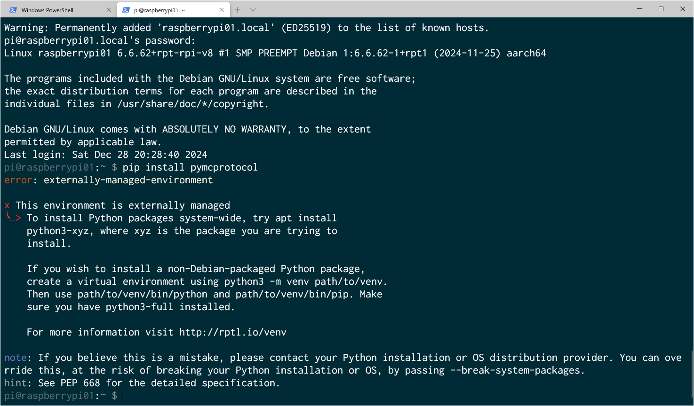
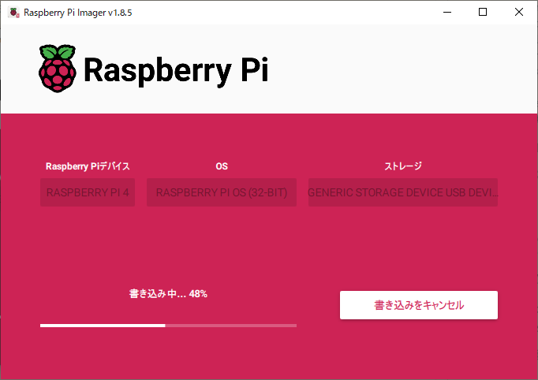
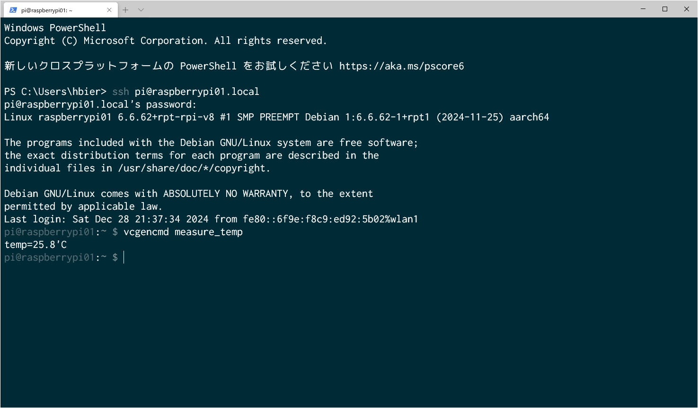
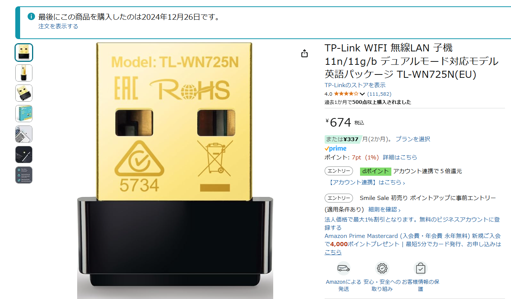
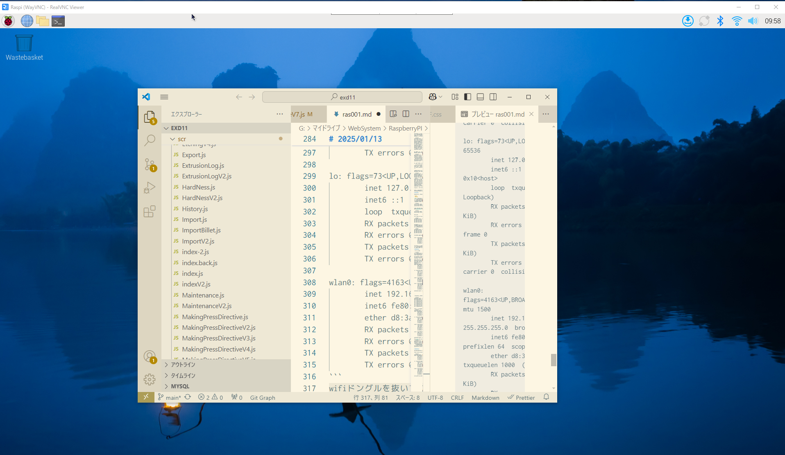
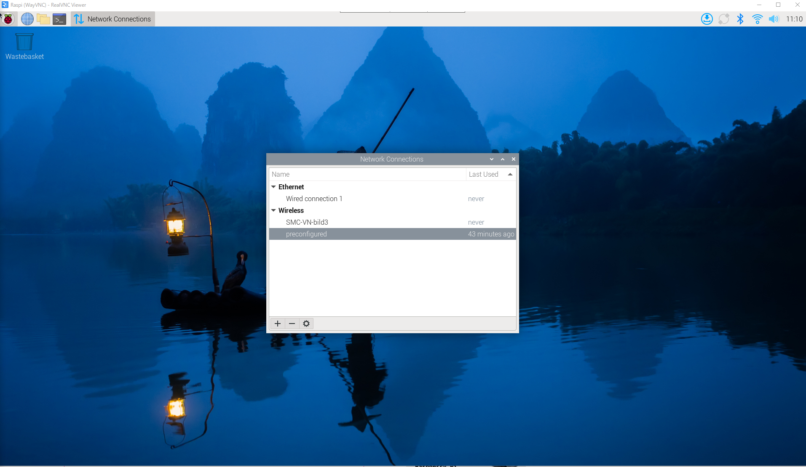
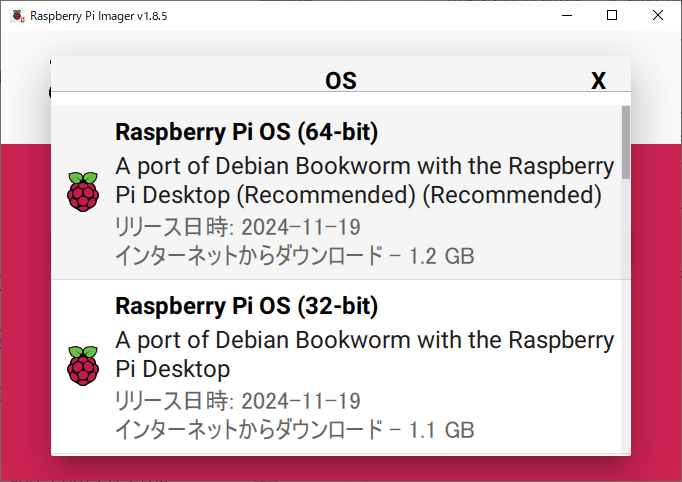

# 24/12/28

RaspberryPI の立上。参考にしたページは、
https://note.com/kaolun_note/n/n58e444dcc38f
ここに、ディスプレイ無しでの立ち上げ方が書いてある。SSH でのログインは、

```terminal
ssh ユーザ名@raspberrypi.local
```

でログインできる。これは便利。
今は、ID:pi Pass:pi の組み合わせ。

では、ここで、ホスト名変更のやり方を見てみよう。

```terminal
sudo raspi-config
```

の画面の中から選択することが出来る。値を保存すると、再起動が自動的にかかる。変更後は raspberrypi01 になった。ログインも問題なし。
では次、MC プロトコルで使用するライブラリをダウンロードする。

とエラーが出る。なんと、これ、`python`が入っていないという事。なので、`python`をインストールしないと。いや、違う。`python`はインストールされているらしい。
このエラーメッセージを見るとそうですね。どうも、This enviroment is externally managed という事らしいので、以下とした。

```terminal
pi@raspberrypi01:~ $ sudo apt update
Hit:1 http://archive.raspberrypi.com/debian bookworm InRelease
Hit:2 http://raspbian.raspberrypi.com/raspbian bookworm InRelease
Reading package lists... Done
Building dependency tree... Done
Reading state information... Done
All packages are up to date.
W: http://raspbian.raspberrypi.com/raspbian/dists/bookworm/InRelease: Key is stored in legacy trusted.gpg keyring (/etc/apt/trusted.gpg), see the DEPRECATION section in apt-key(8) for details.
pi@raspberrypi01:~ $ sudo apt install python3-pymcprotocol
Reading package lists... Done
Building dependency tree... Done
Reading state information... Done
E: Unable to locate package python3-pymcprotocol
pi@raspberrypi01:~ $
```

これで入ったのだろうか？
実はエラーで入っていない。

```terminal
pi@raspberrypi01:~ $ pip install pymcprotocol --break-system-packages
Defaulting to user installation because normal site-packages is not writeable
Looking in indexes: https://pypi.org/simple, https://www.piwheels.org/simple
Collecting pymcprotocol
  Downloading https://www.piwheels.org/simple/pymcprotocol/pymcprotocol-0.3.0-py3-none-any.whl (13 kB)
Installing collected packages: pymcprotocol
Successfully installed pymcprotocol-0.3.0
pi@raspberrypi01:~ $
```

これでうまくいったか？上手くいった。以下がその画面

```terminalpi@raspberrypi01:~ $ python
Python 3.11.2 (main, Sep 14 2024, 03:00:30) [GCC 12.2.0] on linux
Type "help", "copyright", "credits" or "license" for more information.
>>> import pymcprotocol
>>>
```

ちゃんとライブラリが読み込めている。
では次。vs-code をインストールしてみようか。

```terminal
pi@raspberrypi01:~ $ sudo apt install code
Reading package lists... Done
Building dependency tree... Done
Reading state information... Done
The following NEW packages will be installed:
  code
0 upgraded, 1 newly installed, 0 to remove and 0 not upgraded.
Need to get 94.8 MB of archives.
After this operation, 336 MB of additional disk space will be used.
Get:1 http://archive.raspberrypi.com/debian bookworm/main armhf code armhf 1.96.2-1734606979 [94.8 MB]
Fetched 94.8 MB in 1min 7s (1,409 kB/s)
Preconfiguring packages ...
Selecting previously unselected package code.
(Reading database ... 170141 files and directories currently installed.)
Preparing to unpack .../code_1.96.2-1734606979_armhf.deb ...
Unpacking code (1.96.2-1734606979) ...

Progress: [ 20%] [###################...............................................................................]
```

こんな感じで、インストールできそう。でも、これ`terminal`では見れないね。
この環境でも、PLC とのやり取りと、ログを取ることに関しては、多分問題なくできるね。

# 24/12/29

RaspberryPI 二台目。

- ID:pi
- Pass:pi

`SSH`は pi@raspberrypi02@local の設定。

それで、microSD カードを作って、Raspi を起動して接続を確認。

昨日動き始めているラズパイの CPU 温度はこんな感じ。25 度ぐらい。

```terminal
sudo apt-get update
sudo apt-get upgrade
sudo apt-get dist-upgrade
```

を実行して、アップデート。
次に`pymcprotocol`をインストール。OK。ついでに emacs もインストール

```terminal
sudo apt-get update
sudo apt-get install -y emacs
```

#24/12/30

wifi tongle の型番を調べる。アンテナが付いているタイプ

```command
pi@raspberrypi02:~ $ lsusb
Bus 002 Device 001: ID 1d6b:0003 Linux Foundation 3.0 root hub
Bus 001 Device 004: ID 0bda:f179 Realtek Semiconductor Corp. RTL8188FTV 802.11b/g/n 1T1R 2.4G WLAN Adapter
Bus 001 Device 002: ID 2109:3431 VIA Labs, Inc. Hub
Bus 001 Device 001: ID 1d6b:0002 Linux Foundation 2.0 root hub
```

RTL8188FTV が使われている。
ちなみに、挿してすぐに使えた Wifi トングルは以下。

これは以下の様に認識されている。

```command
pi@raspberrypi01:~ $ lsusb
Bus 002 Device 001: ID 1d6b:0003 Linux Foundation 3.0 root hub
Bus 001 Device 003: ID 0bda:8179 Realtek Semiconductor Corp. RTL8188EUS 802.11n Wireless Network Adapter
Bus 001 Device 002: ID 2109:3431 VIA Labs, Inc. Hub
Bus 001 Device 001: ID 1d6b:0002 Linux Foundation 2.0 root hub
```

RTL8188EUS であり、ネットワークアダプターとしては、

```
wlan1: flags=4163<UP,BROADCAST,RUNNING,MULTICAST>  mtu 1500
        inet 192.168.11.12  netmask 255.255.255.0  broadcast 192.168.11.255
        inet6 fe80::769f:6d44:86b:3856  prefixlen 64  scopeid 0x20<link>
        ether 7c:f1:7e:bb:05:0f  txqueuelen 1000  (Ethernet)
        RX packets 169726  bytes 134179634 (127.9 MiB)
        RX errors 0  dropped 0  overruns 0  frame 0
        TX packets 39794  bytes 3882783 (3.7 MiB)
        TX errors 0  dropped 0 overruns 0  carrier 0  collisions 0
```

RTL8188TFV は再起動したぐらいでは認識されない。`copilot`で問い合わせると、答えが返ってくるので、やってみるか。

これでやってみるが、make の段階でエラーが出る。シンボリックリンクが張れない。そのディレクトリが出来ていない。原因は不明。ちょっと、現時点では壁が高すぎる。

# 2025/01/12

出荷前の調整。

```terminal
PS C:\xampp\htdocs\exd11\exd11> ssh pi@raspberrypi01.local
pi@raspberrypi01.local's password:
Linux raspberrypi01 6.6.62+rpt-rpi-v8 #1 SMP PREEMPT Debian 1:6.6.62-1+rpt1 (2024-11-25) aarch64

The programs included with the Debian GNU/Linux system are free software;
the exact distribution terms for each program are described in the
individual files in /usr/share/doc/*/copyright.

Debian GNU/Linux comes with ABSOLUTELY NO WARRANTY, to the extent
permitted by applicable law.
Last login: Sun Jan 12 10:38:13 2025 from fe80::6f9e:f8c9:ed92:5b02%wlan1
pi@raspberrypi01:~ $ vcgencmd measure_temp
temp=27.2'C
pi@raspberrypi01:~ $ ifconfig
eth0: flags=4099<UP,BROADCAST,MULTICAST>  mtu 1500
        ether d8:3a:dd:14:10:18  txqueuelen 1000  (Ethernet)
        RX packets 0  bytes 0 (0.0 B)
        RX errors 0  dropped 0  overruns 0  frame 0
        TX packets 0  bytes 0 (0.0 B)
        TX errors 0  dropped 0 overruns 0  carrier 0  collisions 0

lo: flags=73<UP,LOOPBACK,RUNNING>  mtu 65536
        inet 127.0.0.1  netmask 255.0.0.0
        inet6 ::1  prefixlen 128  scopeid 0x10<host>
        loop  txqueuelen 1000  (Local Loopback)
        RX packets 18  bytes 2196 (2.1 KiB)
        RX errors 0  dropped 0  overruns 0  frame 0
        TX packets 18  bytes 2196 (2.1 KiB)
        TX errors 0  dropped 0 overruns 0  carrier 0  collisions 0

wlan0: flags=4099<UP,BROADCAST,MULTICAST>  mtu 1500
        ether d8:3a:dd:14:10:1a  txqueuelen 1000  (Ethernet)
        RX packets 0  bytes 0 (0.0 B)
        RX errors 0  dropped 0  overruns 0  frame 0
        TX packets 0  bytes 0 (0.0 B)
        TX errors 0  dropped 0 overruns 0  carrier 0  collisions 0

wlan1: flags=4163<UP,BROADCAST,RUNNING,MULTICAST>  mtu 1500
        inet 192.168.11.12  netmask 255.255.255.0  broadcast 192.168.11.255
        inet6 fe80::769f:6d44:86b:3856  prefixlen 64  scopeid 0x20<link>
        ether 7c:f1:7e:bb:05:0f  txqueuelen 1000  (Ethernet)
        RX packets 10763  bytes 15347136 (14.6 MiB)
        RX errors 0  dropped 0  overruns 0  frame 0
        TX packets 4692  bytes 498965 (487.2 KiB)
        TX errors 0  dropped 0 overruns 0  carrier 0  collisions 0

pi@raspberrypi01:~ $


```

現状、こんな感じ。これで、まずは内部の WiFi を無効化する。

```terminal
pi@raspberrypi01:~ $ sudo iwconfig wlan0 txpower off
pi@raspberrypi01:~ $ client_loop: send disconnect: Connection reset
PS C:\xampp\htdocs\exd11\exd11> ssh pi@raspberrypi01.local
ssh: Could not resolve hostname raspberrypi01.local: \202\273\202\314\202\346\202\244\202\310\203z\203X\203g\202\315\225s\226\276\202\305\202\267\201B
PS C:\xampp\htdocs\exd11\exd11> ssh pi@raspberrypi01.local
ssh: Could not resolve hostname raspberrypi01.local: \202\273\202\314\202\346\202\244\202\310\203z\203X\203g\202\315\225s\226\276\202\305\202\267\201B
PS C:\xampp\htdocs\exd11\exd11> ssh pi@raspberrypi01.local
ssh: Could not resolve hostname raspberrypi01.local: \202\273\202\314\202\346\202\244\202\310\203z\203X\203g\202\315\225s\226\276\202\305\202\267\201B
PS C:\xampp\htdocs\exd11\exd11> ssh pi@raspberrypi01.local
ssh: Could not resolve hostname raspberrypi01.local: \202\273\202\314\202\346\202\244\202\310\203z\203X\203g\202\315\225s\226\276\202\305\202\267\201B
PS C:\xampp\htdocs\exd11\exd11>
```

とやったら通信できなくなった。つまり wlan0 で通信していたというわけ。もう一回、ブートディスクを作る。何回か再インストール。wifi ドングルを外さないとだめか、、、

```terminal
pi@raspberrypi01:~ $ ifconfig
eth0: flags=4099<UP,BROADCAST,MULTICAST>  mtu 1500
        ether d8:3a:dd:14:10:18  txqueuelen 1000  (Ethernet)
        RX packets 0  bytes 0 (0.0 B)
        RX errors 0  dropped 0  overruns 0  frame 0
        TX packets 0  bytes 0 (0.0 B)
        TX errors 0  dropped 0 overruns 0  carrier 0  collisions 0

lo: flags=73<UP,LOOPBACK,RUNNING>  mtu 65536
        inet 127.0.0.1  netmask 255.0.0.0
        inet6 ::1  prefixlen 128  scopeid 0x10<host>
        loop  txqueuelen 1000  (Local Loopback)
        RX packets 47  bytes 5313 (5.1 KiB)
        RX errors 0  dropped 0  overruns 0  frame 0
        TX packets 47  bytes 5313 (5.1 KiB)
        TX errors 0  dropped 0 overruns 0  carrier 0  collisions 0

wlan0: flags=4163<UP,BROADCAST,RUNNING,MULTICAST>  mtu 1500
        inet 192.168.11.14  netmask 255.255.255.0  broadcast 192.168.11.255
        inet6 fe80::93cd:3774:ae94:ac93  prefixlen 64  scopeid 0x20<link>
        ether d8:3a:dd:14:10:1a  txqueuelen 1000  (Ethernet)
        RX packets 332285  bytes 478143547 (455.9 MiB)
        RX errors 0  dropped 0  overruns 0  frame 0
        TX packets 97648  bytes 7118468 (6.7 MiB)
        TX errors 0  dropped 0 overruns 0  carrier 0  collisions 0

wlan1: flags=4099<UP,BROADCAST,MULTICAST>  mtu 1500
        ether 7c:f1:7e:bb:05:0f  txqueuelen 1000  (Ethernet)
        RX packets 0  bytes 0 (0.0 B)
        RX errors 0  dropped 0  overruns 0  frame 0
        TX packets 0  bytes 0 (0.0 B)
        TX errors 0  dropped 0 overruns 0  carrier 0  collisions 0

pi@raspberrypi01:~ $
```

この`wlan1`を会社のネットワークに合わせれば、良いのではないか。それと、mysql コネクターを下記でインストール

```terminal
pi@raspberrypi01:~ $ pip install mysql-connector-python --break-system-packages
Defaulting to user installation because normal site-packages is not writeable
Looking in indexes: https://pypi.org/simple, https://www.piwheels.org/simple
Collecting mysql-connector-python
  Downloading mysql_connector_python-9.1.0-py2.py3-none-any.whl (381 kB)
     ━━━━━━━━━━━━━━━━━━━━━━━━━━━━━━━━━━━━━━━━ 381.1/381.1 kB 2.4 MB/s eta 0:00:00
Installing collected packages: mysql-connector-python
Successfully installed mysql-connector-python-9.1.0
```

# 2025/01/13

RealVNC をインストール。以下のサイトを参考にした。

https://qiita.com/pochi4number/items/9ee5ac8506633b0d0776

```terminal
pi@raspberrypi01:~ $ ifconfig
eth0: flags=4099<UP,BROADCAST,MULTICAST>  mtu 1500
        ether d8:3a:dd:14:10:18  txqueuelen 1000  (Ethernet)
        RX packets 0  bytes 0 (0.0 B)
        RX errors 0  dropped 0  overruns 0  frame 0
        TX packets 0  bytes 0 (0.0 B)
        TX errors 0  dropped 0 overruns 0  carrier 0  collisions 0

lo: flags=73<UP,LOOPBACK,RUNNING>  mtu 65536
        inet 127.0.0.1  netmask 255.0.0.0
        inet6 ::1  prefixlen 128  scopeid 0x10<host>
        loop  txqueuelen 1000  (Local Loopback)
        RX packets 16  bytes 2050 (2.0 KiB)
        RX errors 0  dropped 0  overruns 0  frame 0
        TX packets 16  bytes 2050 (2.0 KiB)
        TX errors 0  dropped 0 overruns 0  carrier 0  collisions 0

wlan0: flags=4163<UP,BROADCAST,RUNNING,MULTICAST>  mtu 1500
        inet 192.168.11.14  netmask 255.255.255.0  broadcast 192.168.11.255
        inet6 fe80::93cd:3774:ae94:ac93  prefixlen 64  scopeid 0x20<link>
        ether d8:3a:dd:14:10:1a  txqueuelen 1000  (Ethernet)
        RX packets 81  bytes 10497 (10.2 KiB)
        RX errors 0  dropped 0  overruns 0  frame 0
        TX packets 102  bytes 13817 (13.4 KiB)
        TX errors 0  dropped 0 overruns 0  carrier 0  collisions 0
```

wifi ドングルを抜いて立ち上げると、wlan0 に ip が振ってある。この状態で、VNC クライアントからこの ip を除くと以下の様にリモートディスクトップが見れる。
VNC クライアントを立ち上げると以下のようになる。

この状態で、wifi ドングルを挿してみる。

```terminal
pi@raspberrypi01:~ $ ifconfig
eth0: flags=4099<UP,BROADCAST,MULTICAST>  mtu 1500
        ether d8:3a:dd:14:10:18  txqueuelen 1000  (Ethernet)
        RX packets 0  bytes 0 (0.0 B)
        RX errors 0  dropped 0  overruns 0  frame 0
        TX packets 0  bytes 0 (0.0 B)
        TX errors 0  dropped 0 overruns 0  carrier 0  collisions 0

lo: flags=73<UP,LOOPBACK,RUNNING>  mtu 65536
        inet 127.0.0.1  netmask 255.0.0.0
        inet6 ::1  prefixlen 128  scopeid 0x10<host>
        loop  txqueuelen 1000  (Local Loopback)
        RX packets 20  bytes 2342 (2.2 KiB)
        RX errors 0  dropped 0  overruns 0  frame 0
        TX packets 20  bytes 2342 (2.2 KiB)
        TX errors 0  dropped 0 overruns 0  carrier 0  collisions 0

wlan0: flags=4163<UP,BROADCAST,RUNNING,MULTICAST>  mtu 1500
        inet 192.168.11.14  netmask 255.255.255.0  broadcast 192.168.11.255
        inet6 fe80::93cd:3774:ae94:ac93  prefixlen 64  scopeid 0x20<link>
        ether d8:3a:dd:14:10:1a  txqueuelen 1000  (Ethernet)
        RX packets 4268  bytes 264441 (258.2 KiB)
        RX errors 0  dropped 0  overruns 0  frame 0
        TX packets 9586  bytes 11240232 (10.7 MiB)
        TX errors 0  dropped 0 overruns 0  carrier 0  collisions 0

wlan1: flags=4099<UP,BROADCAST,MULTICAST>  mtu 1500
        ether 7c:f1:7e:bb:05:0f  txqueuelen 1000  (Ethernet)
        RX packets 0  bytes 0 (0.0 B)
        RX errors 0  dropped 0  overruns 0  frame 0
        TX packets 0  bytes 0 (0.0 B)
        TX errors 0  dropped 0 overruns 0  carrier 0  collisions 0
```

wlan1 には何も設定されていないか。ここから設定して固定できるか？設定画面から設定してみて、再起動する。

```terminal
pi@raspberrypi01:~ $ ifconfig
eth0: flags=4099<UP,BROADCAST,MULTICAST>  mtu 1500
        ether d8:3a:dd:14:10:18  txqueuelen 1000  (Ethernet)
        RX packets 0  bytes 0 (0.0 B)
        RX errors 0  dropped 0  overruns 0  frame 0
        TX packets 0  bytes 0 (0.0 B)
        TX errors 0  dropped 0 overruns 0  carrier 0  collisions 0

lo: flags=73<UP,LOOPBACK,RUNNING>  mtu 65536
        inet 127.0.0.1  netmask 255.0.0.0
        inet6 ::1  prefixlen 128  scopeid 0x10<host>
        loop  txqueuelen 1000  (Local Loopback)
        RX packets 95  bytes 8457 (8.2 KiB)
        RX errors 0  dropped 0  overruns 0  frame 0
        TX packets 95  bytes 8457 (8.2 KiB)
        TX errors 0  dropped 0 overruns 0  carrier 0  collisions 0

wlan0: flags=4163<UP,BROADCAST,RUNNING,MULTICAST>  mtu 1500
        inet 192.168.11.14  netmask 255.255.255.0  broadcast 192.168.11.255
        inet6 fe80::93cd:3774:ae94:ac93  prefixlen 64  scopeid 0x20<link>
        ether d8:3a:dd:14:10:1a  txqueuelen 1000  (Ethernet)
        RX packets 74  bytes 9910 (9.6 KiB)
        RX errors 0  dropped 0  overruns 0  frame 0
        TX packets 99  bytes 13618 (13.2 KiB)
        TX errors 0  dropped 0 overruns 0  carrier 0  collisions 0

wlan1: flags=4099<UP,BROADCAST,MULTICAST>  mtu 1500
        ether 7c:f1:7e:bb:05:0f  txqueuelen 1000  (Ethernet)
        RX packets 0  bytes 0 (0.0 B)
        RX errors 0  dropped 0  overruns 0  frame 0
        TX packets 0  bytes 0 (0.0 B)
        TX errors 0  dropped 0 overruns 0  carrier 0  collisions 0
```

再起動して、wlan0 を使っているように固定できた。次は、wlan1 に vn の設定をする。設定は以下の画面。

ただ、wlan1 に ssid やパスワードを設定する方法が分からない。昔と、画面の出てくる内容が異なる。そこで、以下のページが参考になる。
https://qiita.com/mochi_2225/items/15c1e7c1c1ae79f97501

これは画面を通じて設定する方法だが以下は、もう少し詳しい解説

https://raspida.com/nmcli-static-ipaddress/

ネットワークを追加するときは、以下のようにアクセスすると


この画面はネットワークを追加した様子。今の新しいラズパイは、**ネットワークマネージャー**を使うようになった。これが大きな違い。今までの Network Configration は無い。
で、設定した後の画面の確認が、以下がその画面

```terminal
pi@raspberrypi01:~ $ nmcli connection show
NAME                UUID                                  TYPE      DEVICE
preconfigured       7a695a40-dcc1-4420-94f9-1745602592c0  wifi      wlan0
lo                  d271cd16-4caf-4305-9e05-95466bd7b157  loopback  lo
SMC-VN-bild3        40926df4-1291-468d-8505-e6d1ff02d4d6  wifi      --
Wired connection 1  c2221408-f13f-3918-bd45-339461f8c918  ethernet  --
```

SMC-VN-bild3 が設定した内容だが、DEVICE が割り当てられていない。つながっていないせいかな、、、設定を反映させるコマンドを実行

```terminal
pi@raspberrypi01:~ $ sudo nmcli connection reload
pi@raspberrypi01:~ $ sudo nmcli connection up SMC-VN-bild3


Error: Connection activation failed: The Wi-Fi network could not be found
Hint: use 'journalctl -xe NM_CONNECTION=40926df4-1291-468d-8505-e6d1ff02d4d6 + NM_DEVICE=wlan1' to get more details.
pi@raspberrypi01:~ $
```

見つからないとさ。なので、家でできるのはここまでという事か。後は再起動してみる。再起動しても問題ない事確認。
問題なし。今までと違って、ネットワークインターフェースごとに設定するようになった感じ。今までは、プロトコル別な感じ。
ちなみに、今回の Wifi のチップセットは以下。**RTL8188EUS**。

```terminal
pi@raspberrypi01:~ $ lsusb
Bus 002 Device 001: ID 1d6b:0003 Linux Foundation 3.0 root hub
Bus 001 Device 003: ID 0bda:8179 Realtek Semiconductor Corp. RTL8188EUS 802.11n Wireless Network Adapter
Bus 001 Device 002: ID 2109:3431 VIA Labs, Inc. Hub
Bus 001 Device 001: ID 1d6b:0002 Linux Foundation 2.0 root hub
```

2 台目の設定。再度インストール。
以下のログインが出来るようになる。

```terminal
PS C:\Users\hbier> ssh pi@raspberrypi02.local
pi@raspberrypi02.local's password:
Linux raspberrypi02 6.6.51+rpt-rpi-v8 #1 SMP PREEMPT Debian 1:6.6.51-1+rpt3 (2024-10-08) aarch64

The programs included with the Debian GNU/Linux system are free software;
the exact distribution terms for each program are described in the
individual files in /usr/share/doc/*/copyright.

Debian GNU/Linux comes with ABSOLUTELY NO WARRANTY, to the extent
permitted by applicable law.
Last login: Mon Jan 13 15:20:18 2025 from fe80::6f9e:f8c9:ed92:5b02%wlan0
pi@raspberrypi02:~ $
```

その後、いつものやつ

```terminal
sudo apt-get update
sudo apt-get upgrade
sudo apt-get dist-upgrade
```

で vpn 出力できるように、する。

```
sudo sudo raspi-config
```

から VNC サーバーを使えるように設定し、再起動。VNC 確認 OK。

- emacs
- pymcprotocol
- mysql
  のライブラリを読み込む

```terminal
sudo apt-get update
sudo apt-get install -y emacs
```

```
pi@raspberrypi02:~ $ pip install pymcprotocol --break-system-packages
Defaulting to user installation because normal site-packages is not writeable
Looking in indexes: https://pypi.org/simple, https://www.piwheels.org/simple
WARNING: Retrying (Retry(total=4, connect=None, read=None, redirect=None, status=None)) after connection broken by 'SSLError(SSLZeroReturnError(6, 'TLS/SSL connection has been closed (EOF) (_ssl.c:992)'))': /simple/pymcprotocol/
WARNING: Retrying (Retry(total=3, connect=None, read=None, redirect=None, status=None)) after connection broken by 'SSLError(SSLZeroReturnError(6, 'TLS/SSL connection has been closed (EOF) (_ssl.c:992)'))': /simple/pymcprotocol/
WARNING: Retrying (Retry(total=2, connect=None, read=None, redirect=None, status=None)) after connection broken by 'ReadTimeoutError("HTTPSConnectionPool(host='www.piwheels.org', port=443): Read timed out. (read timeout=15)")': /simple/pymcprotocol/
WARNING: Retrying (Retry(total=1, connect=None, read=None, redirect=None, status=None)) after connection broken by 'SSLError(SSLZeroReturnError(6, 'TLS/SSL connection has been closed (EOF) (_ssl.c:992)'))': /simple/pymcprotocol/
WARNING: Retrying (Retry(total=0, connect=None, read=None, redirect=None, status=None)) after connection broken by 'ReadTimeoutError("HTTPSConnectionPool(host='www.piwheels.org', port=443): Read timed out. (read timeout=15)")': /simple/pymcprotocol/
Could not fetch URL https://www.piwheels.org/simple/pymcprotocol/: There was a problem confirming the ssl certificate: HTTPSConnectionPool(host='www.piwheels.org', port=443): Max retries exceeded with url: /simple/pymcprotocol/ (Caused by SSLError(SSLZeroReturnError(6, 'TLS/SSL connection has been closed (EOF) (_ssl.c:992)'))) - skipping
Collecting pymcprotocol
  Downloading pymcprotocol-0.3.0-py3-none-any.whl (13 kB)
Installing collected packages: pymcprotocol
Successfully installed pymcprotocol-0.3.0
```

```
pip install mysql-connector-python --break-system-packages
```

少し、ワーニングが出ているが、良く分からん。こいつは、次に WIFI をセットアップできるか。

CPU 温度の測定についてはこちら、
https://ameblo.jp/shige2006/entry-12693309188.html
見ると、70 度ぐらいになっているがあまり気にしていない。温度の問題じゃないのかな。

# 2025/01/17

外部アンテナを探す。

https://www.google.com/search?q=TP-Link+Archer+T2U+Plus+%E3%83%A9%E3%82%BA%E3%83%91%E3%82%A4&sca_esv=bca4d6818df5eb0f&sxsrf=ADLYWIISTsshByJ3PfjDVEv5XEKe2ZTW7Q%3A1737118612656&ei=lFOKZ9DbJ-69vr0PvLHmmQU&ved=0ahUKEwjQ9duO5_yKAxXunq8BHbyYOVMQ4dUDCBA&uact=5&oq=TP-Link+Archer+T2U+Plus+%E3%83%A9%E3%82%BA%E3%83%91%E3%82%A4&gs_lp=Egxnd3Mtd2l6LXNlcnAiJFRQLUxpbmsgQXJjaGVyIFQyVSBQbHVzIOODqeOCuuODkeOCpDIIEAAYgAQYogQyCBAAGIAEGKIEMggQABiABBiiBDIIEAAYgAQYogQyCBAAGIAEGKIESO4yUMIIWIwwcAF4AZABAJgB5gGgAYQGqgEFMC40LjG4AQPIAQD4AQGYAgWgArAFwgIKEAAYsAMY1gQYR8ICBRAAGIAEwgIEEAAYHsICBhAAGAoYHsICBhAAGAQYHsICBRAhGKABmAMAiAYBkAYKkgcFMS4zLjGgB_YP&sclient=gws-wiz-serp
には、`TP-Link Archer T2U Plus`を使った接続の仕方が乗っている。いずれ、ドライバーをインストールしなければならない。

# 2025/04/16

久しぶりに再開。VNC サーバーのパスワードは"factory3"とした。

# 2025/04/18

再インストール。その後、ログインしようとすると、以下の様にエラーが出る。これは、

```terminal
PS C:\Users\hbier> ssh pi@raspberrypi01.local
@@@@@@@@@@@@@@@@@@@@@@@@@@@@@@@@@@@@@@@@@@@@@@@@@@@@@@@@@@@
@    WARNING: REMOTE HOST IDENTIFICATION HAS CHANGED!     @
@@@@@@@@@@@@@@@@@@@@@@@@@@@@@@@@@@@@@@@@@@@@@@@@@@@@@@@@@@@
IT IS POSSIBLE THAT SOMEONE IS DOING SOMETHING NASTY!
Someone could be eavesdropping on you right now (man-in-the-middle attack)!
It is also possible that a host key has just been changed.
The fingerprint for the ED25519 key sent by the remote host is
SHA256:C/mSbIuUgbfaO2tOSxZ0UbrX9zH30iespDqjsycci80.
Please contact your system administrator.
Add correct host key in C:\\Users\\hbier/.ssh/known_hosts to get rid of this message.
Offending ECDSA key in C:\\Users\\hbier/.ssh/known_hosts:4
Host key for raspberrypi01.local has changed and you have requested strict checking.
Host key verification failed.
```

これは、ローカルに残っている過去の id と異なるため。

```terminal
C:\Users\hbier\.ssh
```

この中に有る known_hosts の file 内に古いデータが残っているため。該当する SSH の項目を削除する。その後で、

```terminal
sudo apt-get update
sudo apt-get upgrade
sudo apt-get dist-upgrade
```

なんだけど、これ、一つ一つ入れないとだめなんだよな。バッチにならないかな？なるけど、vx でバッチファイルを作る地獄が待っている。やったけど、途中で、問い合わせが入るため、あんまりメリット無し。vnc を立ち上げる

```terminal
sudo raspi-config
```

設定完了。再起動する。USB Wi-Fi トングル入っていない状態でのインターフェイスの状況

```terminal
pi@raspberrypi01:~ $ ifconfig
eth0: flags=4099<UP,BROADCAST,MULTICAST>  mtu 1500
        ether d8:3a:dd:14:03:84  txqueuelen 1000  (Ethernet)
        RX packets 0  bytes 0 (0.0 B)
        RX errors 0  dropped 0  overruns 0  frame 0
        TX packets 0  bytes 0 (0.0 B)
        TX errors 0  dropped 0 overruns 0  carrier 0  collisions 0

lo: flags=73<UP,LOOPBACK,RUNNING>  mtu 65536
        inet 127.0.0.1  netmask 255.0.0.0
        inet6 ::1  prefixlen 128  scopeid 0x10<host>
        loop  txqueuelen 1000  (Local Loopback)
        RX packets 96  bytes 8530 (8.3 KiB)
        RX errors 0  dropped 0  overruns 0  frame 0
        TX packets 96  bytes 8530 (8.3 KiB)
        TX errors 0  dropped 0 overruns 0  carrier 0  collisions 0

wlan0: flags=4163<UP,BROADCAST,RUNNING,MULTICAST>  mtu 1500
        inet 192.168.11.10  netmask 255.255.255.0  broadcast 192.168.11.255
        inet6 fe80::371b:4614:9742:c695  prefixlen 64  scopeid 0x20<link>
        ether d8:3a:dd:14:03:87  txqueuelen 1000  (Ethernet)
        RX packets 10421  bytes 15066087 (14.3 MiB)
        RX errors 0  dropped 0  overruns 0  frame 0
        TX packets 3858  bytes 264573 (258.3 KiB)
        TX errors 0  dropped 0 overruns 0  carrier 0  collisions 0
```

## vnc インストール

vnc は

```terminal
sudo raspi-config
```

から、Interface Options から vnc を使用するを設定。再起動する。再起動後にクライアントソフトから、raspi の ip アドレス宛で接続を試みればいい。聞かれるのは、ログイン id とパスワード。

## pymcprotocol インストール

次は、ソフトウェアのインストール。pymcprotocol のインストール

```terminal
pi@raspberrypi01:~ $ pip install pymcprotocol --break-system-packages
Defaulting to user installation because normal site-packages is not writeable
Looking in indexes: https://pypi.org/simple, https://www.piwheels.org/simple
Collecting pymcprotocol
  Downloading https://www.piwheels.org/simple/pymcprotocol/pymcprotocol-0.3.0-py3-none-any.whl (13 kB)
Installing collected packages: pymcprotocol
Successfully installed pymcprotocol-0.3.0
pi@raspberrypi01:~ $
```

確認は、以下。

```terminal
pi@raspberrypi01:~ $ python
Python 3.11.2 (main, Nov 30 2024, 21:22:50) [GCC 12.2.0] on linux
Type "help", "copyright", "credits" or "license" for more information.
>>> import pymcprotocol
>>>
pi@raspberrypi01:~ $
```

ちゃんと、pymcprotocol を読み込めている。

## vs code インストール

以下のコードでいい

```terminal
pi@raspberrypi01:~ $ sudo apt install code
```

## emacs インストール

```terminal
sudo apt-get update
sudo apt-get install -y emacs
```

## 次、ネットワークの固定化

現状は以下の様になっている

```terminal
pi@raspberrypi01:~/work $ nmcli c
NAME                UUID                                  TYPE      DEVICE
preconfigured       730b9a4a-85af-4004-a122-480ed2b0b3e5  wifi      wlan0
lo                  2ed5448d-b9a5-4a63-b764-cc0a8e91be62  loopback  lo
Wired connection 1  09f926ea-7ae2-30e7-90f3-280aec2e6ce7  ethernet  --
```

この状態で、以下のコマンドで、固定化できるか？

```terminal
pi@raspberrypi01:~/work $ sudo nmcli con mod "730b9a4a-85af-4004-a122-480ed2b0b3e5" \
> ipv4.method "manual" \
> ipv4.address "192.168.11.10" \
> ipv4.gateway "192.168.1.1"
pi@raspberrypi01:~/work $
```

これで固定化できたはずなので、この状態で、wifi ドングルを挿してみる。挿すだけで、以下の様に認識する。

```terminal
pi@raspberrypi01:~ $ ifconfig
eth0: flags=4099<UP,BROADCAST,MULTICAST>  mtu 1500
        ether d8:3a:dd:14:03:84  txqueuelen 1000  (Ethernet)
        RX packets 0  bytes 0 (0.0 B)
        RX errors 0  dropped 0  overruns 0  frame 0
        TX packets 0  bytes 0 (0.0 B)
        TX errors 0  dropped 0 overruns 0  carrier 0  collisions 0

lo: flags=73<UP,LOOPBACK,RUNNING>  mtu 65536
        inet 127.0.0.1  netmask 255.0.0.0
        inet6 ::1  prefixlen 128  scopeid 0x10<host>
        loop  txqueuelen 1000  (Local Loopback)
        RX packets 955  bytes 78685 (76.8 KiB)
        RX errors 0  dropped 0  overruns 0  frame 0
        TX packets 955  bytes 78685 (76.8 KiB)
        TX errors 0  dropped 0 overruns 0  carrier 0  collisions 0

wlan0: flags=4163<UP,BROADCAST,RUNNING,MULTICAST>  mtu 1500
        inet 192.168.11.10  netmask 255.255.255.255  broadcast 0.0.0.0
        inet6 fe80::371b:4614:9742:c695  prefixlen 64  scopeid 0x20<link>
        ether d8:3a:dd:14:03:87  txqueuelen 1000  (Ethernet)
        RX packets 413  bytes 55582 (54.2 KiB)
        RX errors 0  dropped 0  overruns 0  frame 0
        TX packets 350  bytes 35553 (34.7 KiB)
        TX errors 0  dropped 0 overruns 0  carrier 0  collisions 0

wlan1: flags=4099<UP,BROADCAST,MULTICAST>  mtu 1500
        ether 98:ba:5f:8d:e7:1f  txqueuelen 1000  (Ethernet)
        RX packets 0  bytes 0 (0.0 B)
        RX errors 0  dropped 0  overruns 0  frame 0
        TX packets 0  bytes 0 (0.0 B)
        TX errors 0  dropped 0 overruns 0  carrier 0  collisions 0

pi@raspberrypi01:~ $
```

再起動して再度確認。以下の様になっており、固定化されていない。

```terminal
pi@raspberrypi01:~ $ ifconfig
eth0: flags=4099<UP,BROADCAST,MULTICAST>  mtu 1500
        ether d8:3a:dd:14:03:84  txqueuelen 1000  (Ethernet)
        RX packets 0  bytes 0 (0.0 B)
        RX errors 0  dropped 0  overruns 0  frame 0
        TX packets 0  bytes 0 (0.0 B)
        TX errors 0  dropped 0 overruns 0  carrier 0  collisions 0

lo: flags=73<UP,LOOPBACK,RUNNING>  mtu 65536
        inet 127.0.0.1  netmask 255.0.0.0
        inet6 ::1  prefixlen 128  scopeid 0x10<host>
        loop  txqueuelen 1000  (Local Loopback)
        RX packets 305  bytes 26138 (25.5 KiB)
        RX errors 0  dropped 0  overruns 0  frame 0
        TX packets 305  bytes 26138 (25.5 KiB)
        TX errors 0  dropped 0 overruns 0  carrier 0  collisions 0

wlan0: flags=4099<UP,BROADCAST,MULTICAST>  mtu 1500
        ether d8:3a:dd:14:03:87  txqueuelen 1000  (Ethernet)
        RX packets 0  bytes 0 (0.0 B)
        RX errors 0  dropped 0  overruns 0  frame 0
        TX packets 0  bytes 0 (0.0 B)
        TX errors 0  dropped 0 overruns 0  carrier 0  collisions 0

wlan1: flags=4163<UP,BROADCAST,RUNNING,MULTICAST>  mtu 1500
        inet 192.168.11.10  netmask 255.255.255.255  broadcast 0.0.0.0
        inet6 fe80::da8c:e82a:9daf:625b  prefixlen 64  scopeid 0x20<link>
        ether 98:ba:5f:8d:e7:1f  txqueuelen 1000  (Ethernet)
        RX packets 86  bytes 21055 (20.5 KiB)
        RX errors 0  dropped 0  overruns 0  frame 0
        TX packets 80  bytes 13093 (12.7 KiB)
        TX errors 0  dropped 0 overruns 0  carrier 0  collisions 0

pi@raspberrypi01:~ $
```

以下を見ると、マニュアル設定にはなっているけど、それが、wlan0 に固定されていない感じかな。

```terminal
pi@raspberrypi01:~ $ nmcli c
NAME                UUID                                  TYPE      DEVICE
preconfigured       730b9a4a-85af-4004-a122-480ed2b0b3e5  wifi      wlan1
lo                  46453ed4-06e8-4653-b22c-6b4a82f8ebaf  loopback  lo
Wired connection 1  09f926ea-7ae2-30e7-90f3-280aec2e6ce7  ethernet  --
pi@raspberrypi01:~ $
```

一旦、ドングルを外す。ドングルを外すと、接続できなくなる。再起動。接続可能。vnc が接続できなくなる。raspi-config でもう一度、設定。再起動。ダメ。手動で vnc サーバーを立ち上げてもダメ。

再度、ブートディスクの書き込み。まず、raspi-config で vnc を立ち上げる。その状態で、vnc クライアントを立ち上げるとつながる。でも、netstat の状態は以下。

```terminal
pi@raspberrypi01:~ $ netstat -nlt
Active Internet connections (only servers)
Proto Recv-Q Send-Q Local Address           Foreign Address         State
tcp        0      0 127.0.0.1:631           0.0.0.0:*               LISTEN
tcp        0      0 0.0.0.0:22              0.0.0.0:*               LISTEN
tcp6       0      0 ::1:631                 :::*                    LISTEN
tcp6       0      0 :::5900                 :::*                    LISTEN
tcp6       0      0 :::22                   :::*                    LISTEN
```

これでもつながるんだ。この後に、

```terminal
pi@raspberrypi01:~ $ nmcli c
NAME                UUID                                  TYPE      DEVICE
preconfigured       a256293a-3781-420d-987d-575c6793550d  wifi      wlan0
lo                  f2d7bb5b-645b-40fc-947c-6050840e5271  loopback  lo
Wired connection 1  3562e7b3-3edd-37c6-bf9f-1454157e0578  ethernet  --
pi@raspberrypi01:~ $ sudo nmcli con mod "preconfigured" \
> ipv4.method "manual" \
> ipv4.address "192.168.11.10" \
> ipv4.gateway "192.168.1.1" \
> connection.interface-name "wlan0"
pi@raspberrypi01:~ $ sudo nmcli connection reload
pi@raspberrypi01:~ $ sudo nmcli connection up "preconfigured"
Connection successfully activated (D-Bus active path: /org/freedesktop/NetworkManager/ActiveConnection/3)
pi@raspberrypi01:~ $ nmcli c
NAME                UUID                                  TYPE      DEVICE
preconfigured       a256293a-3781-420d-987d-575c6793550d  wifi      wlan0
lo                  f2d7bb5b-645b-40fc-947c-6050840e5271  loopback  lo
Wired connection 1  3562e7b3-3edd-37c6-bf9f-1454157e0578  ethernet  --
```

を実行すると、vnc の接続が出来なくなっている。raspi-cinfg を再度実行しても、接続は出来ない。

再度ブートディスクを作る。今度は、先に、ネットワークの固定を行う。vnc サーバー立ち上がる。

そしたら、次に、ソフトウェアのアップデート。その後、

- mcprotocol
- visual sutudio code
- emacs

のインストール

```termminal
pip install pymcprotocol --break-system-packages
```

次

```terminal
pi@raspberrypi01:~ $ sudo apt install code
```

主なソフトウェアのインストールは完了。現在、VNC はちゃんと動いている。再起動してみるか。上手く動く。次は、wifi ドングルを挿した時の挙動はどうか？あら、挿しただけでは、動作しない。認識していないみたい。

```terminal
pi@raspberrypi01:~ $ lsusb
Bus 002 Device 001: ID 1d6b:0003 Linux Foundation 3.0 root hub
Bus 001 Device 002: ID 2109:3431 VIA Labs, Inc. Hub
Bus 001 Device 001: ID 1d6b:0002 Linux Foundation 2.0 root hub
pi@raspberrypi01:~ $ lsusb
Bus 002 Device 001: ID 1d6b:0003 Linux Foundation 3.0 root hub
Bus 001 Device 002: ID 2109:3431 VIA Labs, Inc. Hub
Bus 001 Device 001: ID 1d6b:0002 Linux Foundation 2.0 root hub
pi@raspberrypi01:~ $
```

再起動してみる。あれ、認識しない。vnc は動作中。vnc を停止して、再起動してみる。だめ。うわーめんどくさいな。

次は、ネットワークを完成させた後に、vnc が起動できるかどうか？。vnc が無くても、機能上は問題が無い。ネットワークの完成は、ip の固定。まずは、現状の記録

```terminal
pi@raspberrypi01:~ $ lsusb
Bus 002 Device 001: ID 1d6b:0003 Linux Foundation 3.0 root hub
Bus 001 Device 002: ID 2109:3431 VIA Labs, Inc. Hub
Bus 001 Device 001: ID 1d6b:0002 Linux Foundation 2.0 root hub
pi@raspberrypi01:~ $ nmcli c
NAME                UUID                                  TYPE      DEVICE
preconfigured       f14213ca-c1d0-483c-8047-3e362f8169ca  wifi      wlan0
lo                  15acdccb-4930-4c6b-9008-36b69fae7503  loopback  lo
Wired connection 1  e79c8647-399d-3155-97f7-fe3b45a169c8  ethernet  --
pi@raspberrypi01:~ $ ifconfig
eth0: flags=4099<UP,BROADCAST,MULTICAST>  mtu 1500
        ether d8:3a:dd:14:03:84  txqueuelen 1000  (Ethernet)
        RX packets 0  bytes 0 (0.0 B)
        RX errors 0  dropped 0  overruns 0  frame 0
        TX packets 0  bytes 0 (0.0 B)
        TX errors 0  dropped 0 overruns 0  carrier 0  collisions 0

lo: flags=73<UP,LOOPBACK,RUNNING>  mtu 65536
        inet 127.0.0.1  netmask 255.0.0.0
        inet6 ::1  prefixlen 128  scopeid 0x10<host>
        loop  txqueuelen 1000  (Local Loopback)
        RX packets 20  bytes 2332 (2.2 KiB)
        RX errors 0  dropped 0  overruns 0  frame 0
        TX packets 20  bytes 2332 (2.2 KiB)
        TX errors 0  dropped 0 overruns 0  carrier 0  collisions 0

wlan0: flags=4163<UP,BROADCAST,RUNNING,MULTICAST>  mtu 1500
        inet 192.168.11.10  netmask 255.255.255.0  broadcast 192.168.11.255
        inet6 fe80::430:40fe:b4ca:631e  prefixlen 64  scopeid 0x20<link>
        ether d8:3a:dd:14:03:87  txqueuelen 1000  (Ethernet)
        RX packets 269  bytes 82490 (80.5 KiB)
        RX errors 0  dropped 0  overruns 0  frame 0
        TX packets 212  bytes 26721 (26.0 KiB)
        TX errors 0  dropped 0 overruns 0  carrier 0  collisions 0

pi@raspberrypi01:~ $
```

この状態で、ネットワークを以下の様にいじると、接続が切れる。

```termianl
pi@raspberrypi01:~ $ sudo nmcli con mod "preconfigured" \
> ipv4.method "manual" \
> ipv4.address "192.168.11.11" \
> ipv4.gateway "192.168.1.1" \
> connection.interface-name "wlan0"
pi@raspberrypi01:~ $ sudo nmcli con mod "preconfigured" \
> ipv6.method disabled
pi@raspberrypi01:~ $ sudo nmcli connection reload
pi@raspberrypi01:~ $ sudo nmcli connection up "preconfigured"
client_loop: send disconnect: Connection reset
PS C:\Users\hbier>
```

ヤバイ、接続できなくなった。電源を切って再起動してみる。ip を変更したのがいけなかったかな。

```terminal
pi@raspberrypi01:~ $ nmcli c
NAME                UUID                                  TYPE      DEVICE
preconfigured       88e5b0c5-033d-415d-9681-215b55f31118  wifi      wlan0
lo                  d1808985-a61e-4558-8a75-98e7883e2d8d  loopback  lo
Wired connection 1  3d0cfee6-1ee0-3117-8854-ab378d0e7ce6  ethernet  --
pi@raspberrypi01:~ $
```

```terminal
pi@raspberrypi01:~ $ sudo nmcli con mod "preconfigured" \
> ipv4.method "manual" \
> ipv4.address "192.168.11.10" \
> ipv4.gateway "192.168.1.1" \
> connection.interface-name "wlan0"
pi@raspberrypi01:~ $ sudo nmcli connection reload
pi@raspberrypi01:~ $ sudo nmcli connection up "preconfigured"
```

あれ、やっぱりだめ。

```terminal
PS C:\Users\hbier> ssh pi@raspberrypi01.local
ssh: connect to host raspberrypi01.local port 22: Connection timed out
PS C:\Users\hbier>
```

もう一回やってみる。

```terminal
pi@raspberrypi01:~ $ sudo nmcli con mod "preconfigured" \
> ipv4.method "manual" \
> ipv4.address "192.168.11.10" \
> ipv4.gateway "192.168.1.1" \
> connection.interface-name "wlan0"
pi@raspberrypi01:~ $ sudo nmcli connection reload
pi@raspberrypi01:~ $ sudo nmcli connection up "preconfigured"
Connection successfully activated (D-Bus active path: /org/freedesktop/NetworkManager/ActiveConnection/3)
```

出来た。ipv6 入れない方がいいのか？
次は、wifi ドングルを挿してみる。再起動。

```terminal
pi@raspberrypi01:~ $ ifconfig
eth0: flags=4099<UP,BROADCAST,MULTICAST>  mtu 1500
        ether d8:3a:dd:14:03:84  txqueuelen 1000  (Ethernet)
        RX packets 0  bytes 0 (0.0 B)
        RX errors 0  dropped 0  overruns 0  frame 0
        TX packets 0  bytes 0 (0.0 B)
        TX errors 0  dropped 0 overruns 0  carrier 0  collisions 0

lo: flags=73<UP,LOOPBACK,RUNNING>  mtu 65536
        inet 127.0.0.1  netmask 255.0.0.0
        inet6 ::1  prefixlen 128  scopeid 0x10<host>
        loop  txqueuelen 1000  (Local Loopback)
        RX packets 35  bytes 3362 (3.2 KiB)
        RX errors 0  dropped 0  overruns 0  frame 0
        TX packets 35  bytes 3362 (3.2 KiB)
        TX errors 0  dropped 0 overruns 0  carrier 0  collisions 0

wlan0: flags=4163<UP,BROADCAST,RUNNING,MULTICAST>  mtu 1500
        inet 192.168.11.10  netmask 255.255.255.255  broadcast 0.0.0.0
        inet6 fe80::1da6:d945:fe7c:6e4b  prefixlen 64  scopeid 0x20<link>
        ether d8:3a:dd:14:03:87  txqueuelen 1000  (Ethernet)
        RX packets 808  bytes 123309 (120.4 KiB)
        RX errors 0  dropped 0  overruns 0  frame 0
        TX packets 615  bytes 74316 (72.5 KiB)
        TX errors 0  dropped 0 overruns 0  carrier 0  collisions 0

pi@raspberrypi01:~ $ lsusb
Bus 002 Device 001: ID 1d6b:0003 Linux Foundation 3.0 root hub
Bus 001 Device 002: ID 2109:3431 VIA Labs, Inc. Hub
Bus 001 Device 001: ID 1d6b:0002 Linux Foundation 2.0 root hub
pi@raspberrypi01:~ $ sudo reboot
```

認識しない。接続できるが、、、、update してみるか。
妙に、update 時間が短い。ダメ。認識しない。これでは使えないね。再度ブートディスクを作る。次は、update 後、ネットワークの設定をしてみる。

update 後、ネットワーク設定をしたが、、ドングル認識しない。。。再起動してみる。壊れた？壊れたっぽい。windows で認識しない。

他の PC で使っていたドングルを取り出して、挿してみる。（再起動は無し）その結果が以下。

```terminal
pi@raspberrypi01:~ $ lsusb
Bus 002 Device 001: ID 1d6b:0003 Linux Foundation 3.0 root hub
Bus 001 Device 003: ID 0411:016f BUFFALO INC. (formerly MelCo., Inc.) WLI-UC-G301N Wireless LAN Adapter [Ralink RT3072]
Bus 001 Device 002: ID 2109:3431 VIA Labs, Inc. Hub
Bus 001 Device 001: ID 1d6b:0002 Linux Foundation 2.0 root hub
pi@raspberrypi01:~ $ ifconfig
eth0: flags=4099<UP,BROADCAST,MULTICAST>  mtu 1500
        ether d8:3a:dd:14:03:84  txqueuelen 1000  (Ethernet)
        RX packets 0  bytes 0 (0.0 B)
        RX errors 0  dropped 0  overruns 0  frame 0
        TX packets 0  bytes 0 (0.0 B)
        TX errors 0  dropped 0 overruns 0  carrier 0  collisions 0

lo: flags=73<UP,LOOPBACK,RUNNING>  mtu 65536
        inet 127.0.0.1  netmask 255.0.0.0
        inet6 ::1  prefixlen 128  scopeid 0x10<host>
        loop  txqueuelen 1000  (Local Loopback)
        RX packets 193956  bytes 15659799 (14.9 MiB)
        RX errors 0  dropped 0  overruns 0  frame 0
        TX packets 193956  bytes 15659799 (14.9 MiB)
        TX errors 0  dropped 0 overruns 0  carrier 0  collisions 0

wlan0: flags=4163<UP,BROADCAST,RUNNING,MULTICAST>  mtu 1500
        inet 192.168.11.10  netmask 255.255.255.255  broadcast 0.0.0.0
        inet6 fe80::d2dc:583f:2710:b929  prefixlen 64  scopeid 0x20<link>
        ether d8:3a:dd:14:03:87  txqueuelen 1000  (Ethernet)
        RX packets 7088  bytes 630295 (615.5 KiB)
        RX errors 0  dropped 0  overruns 0  frame 0
        TX packets 5889  bytes 268905 (262.6 KiB)
        TX errors 0  dropped 0 overruns 0  carrier 0  collisions 0

wlan1: flags=4099<UP,BROADCAST,MULTICAST>  mtu 1500
        ether b0:c7:45:78:46:01  txqueuelen 1000  (Ethernet)
        RX packets 0  bytes 0 (0.0 B)
        RX errors 0  dropped 0  overruns 0  frame 0
        TX packets 0  bytes 0 (0.0 B)
        TX errors 0  dropped 0 overruns 0  carrier 0  collisions 0

pi@raspberrypi01:~ $
```

では、ここから、vnc サーバーが動くかやってみる。やっぱりだめ。ソフトウェアのインストール。インターネットにつながらない。。ネットワーク設定おかしい。迷子になっちゃった。再度ブートディスクを作る。

```terminal
sudo nmcli con mod "preconfigured" \
ipv4.method "manual" \
ipv4.addresses "192.168.11.10/24" \
ipv4.gateway "192.168.11.10" \
ipv4.dns 192.168.11.10,8.8.8.8
```

この設定だと、インターネットに出られなくなる。

```terminal
method=auto
```

と、書き換える。

```terminal
pi@raspberrypi01:~ $ cat /etc/resolv.conf
# Generated by NetworkManager
search localdomain
nameserver 192.168.11.1
```

DNS はここに設定されているはずだが、、、

```terminal
wlan0: flags=4163<UP,BROADCAST,RUNNING,MULTICAST>  mtu 1500
        inet 192.168.11.10  netmask 255.255.255.0  broadcast 192.168.11.255
        inet6 fe80::2827:ce22:60be:763e  prefixlen 64  scopeid 0x20<link>
        ether d8:3a:dd:14:03:87  txqueuelen 1000  (Ethernet)
        RX packets 232882  bytes 334400657 (318.9 MiB)
        RX errors 0  dropped 0  overruns 0  frame 0
        TX packets 58919  bytes 4475691 (4.2 MiB)
        TX errors 0  dropped 0 overruns 0  carrier 0  collisions 0
```

これが自動取得時の設定内容。この内容なら、ちゃんとインターネットに出られる。
update 途中でなんでかつながらなくなる。。。。だんだん、状況が悪くなる。
再びブートディスクを作り、次に、update、upgrade していく。

ふと思いついた、wlan0 に家のネットワークが接続されているなら、そのままドングルを挿せばいいのではないか？という事で、挿してみる。

```terminal
pi@raspberrypi01:~ $ ifconfig
eth0: flags=4099<UP,BROADCAST,MULTICAST>  mtu 1500
        ether d8:3a:dd:14:03:84  txqueuelen 1000  (Ethernet)
        RX packets 0  bytes 0 (0.0 B)
        RX errors 0  dropped 0  overruns 0  frame 0
        TX packets 0  bytes 0 (0.0 B)
        TX errors 0  dropped 0 overruns 0  carrier 0  collisions 0

lo: flags=73<UP,LOOPBACK,RUNNING>  mtu 65536
        inet 127.0.0.1  netmask 255.0.0.0
        inet6 ::1  prefixlen 128  scopeid 0x10<host>
        loop  txqueuelen 1000  (Local Loopback)
        RX packets 42  bytes 4948 (4.8 KiB)
        RX errors 0  dropped 0  overruns 0  frame 0
        TX packets 42  bytes 4948 (4.8 KiB)
        TX errors 0  dropped 0 overruns 0  carrier 0  collisions 0

wlan0: flags=4163<UP,BROADCAST,RUNNING,MULTICAST>  mtu 1500
        inet 192.168.11.10  netmask 255.255.255.0  broadcast 192.168.11.255
        inet6 fe80::628d:6c23:6059:919b  prefixlen 64  scopeid 0x20<link>
        ether d8:3a:dd:14:03:87  txqueuelen 1000  (Ethernet)
        RX packets 522336  bytes 755591739 (720.5 MiB)
        RX errors 0  dropped 0  overruns 0  frame 0
        TX packets 117775  bytes 8719599 (8.3 MiB)
        TX errors 0  dropped 0 overruns 0  carrier 0  collisions 0

wlan1: flags=4099<UP,BROADCAST,MULTICAST>  mtu 1500
        ether b0:c7:45:78:46:01  txqueuelen 1000  (Ethernet)
        RX packets 0  bytes 0 (0.0 B)
        RX errors 0  dropped 0  overruns 0  frame 0
        TX packets 0  bytes 0 (0.0 B)
        TX errors 0  dropped 0 overruns 0  carrier 0  collisions 0
```

成功。多分、ソフトのインストールも出来る。VNC も出来る。後は、wlan1 の設定と、eth0 の設定をしてあげれば、出荷準備 OK。

# 2025/04/26

ラズパイインストール手順

- Rasberry Pi Imager を使って、SD カードを作る。その時、コンピュータ名、パスワード、Wifi 設定を指定する。
- ブートが終わったら、アップデート。3 つのコマンド

```terminal
sudo apt-get update
sudo apt-get upgrade
sudo apt-get dist-upgrade
```

- mcprotocol の拡張バージョン、emacs、code をインストール

```terminal
pi@raspberrypi01:~ $ pip install pymcprotocol --break-system-packages
Defaulting to user installation because normal site-packages is not writeable
Looking in indexes: https://pypi.org/simple, https://www.piwheels.org/simple
Collecting pymcprotocol
  Downloading https://www.piwheels.org/simple/pymcprotocol/pymcprotocol-0.3.0-py3-none-any.whl (13 kB)
Installing collected packages: pymcprotocol
Successfully installed pymcprotocol-0.3.0
pi@raspberrypi01:~ $
```

- Network Manager の wifi 設定が preconfigured に入っているので、この設定を wlan0 に固定する指定をする。

```terminal
pi@raspberrypi02:~ $ sudo cat /etc/NetworkManager/system-connections/preconfigured.nmconnection
[connection]
id=preconfigured
uuid=0394e0c5-74df-4379-9691-665f22541584
type=wifi
interface-name=wlan0
[wifi]
mode=infrastructure
ssid=Buffalo-G-201C
hidden=false
[ipv4]
method=auto
[ipv6]
addr-gen-mode=default
method=auto
[proxy]
[wifi-security]
key-mgmt=wpa-psk
psk=96ee21b64465e6ccc4dd7f07a649aaef10100188de5742b827565c8d4b7e7e82
pi@raspberrypi02:~ $
```

- vnc サーバーを起動するように raspi-config で設定をする。
- wifi ドングルを挿す
  ifconfig すると、以下のようになる。

```terminal
pi@raspberrypi01:~ $ ifconfig
eth0: flags=4099<UP,BROADCAST,MULTICAST>  mtu 1500
        ether d8:3a:dd:14:03:84  txqueuelen 1000  (Ethernet)
        RX packets 0  bytes 0 (0.0 B)
        RX errors 0  dropped 0  overruns 0  frame 0
        TX packets 0  bytes 0 (0.0 B)
        TX errors 0  dropped 0 overruns 0  carrier 0  collisions 0

lo: flags=73<UP,LOOPBACK,RUNNING>  mtu 65536
        inet 127.0.0.1  netmask 255.0.0.0
        inet6 ::1  prefixlen 128  scopeid 0x10<host>
        loop  txqueuelen 1000  (Local Loopback)
        RX packets 98  bytes 8676 (8.4 KiB)
        RX errors 0  dropped 0  overruns 0  frame 0
        TX packets 98  bytes 8676 (8.4 KiB)
        TX errors 0  dropped 0 overruns 0  carrier 0  collisions 0

wlan0: flags=4163<UP,BROADCAST,RUNNING,MULTICAST>  mtu 1500
        inet 192.168.11.10  netmask 255.255.255.0  broadcast 192.168.11.255
        ether d8:3a:dd:14:03:87  txqueuelen 1000  (Ethernet)
        RX packets 592  bytes 37962 (37.0 KiB)
        RX errors 0  dropped 0  overruns 0  frame 0
        TX packets 3153  bytes 4419679 (4.2 MiB)
        TX errors 0  dropped 0 overruns 0  carrier 0  collisions 0

wlan1: flags=4099<UP,BROADCAST,MULTICAST>  mtu 1500
        ether b0:c7:45:78:46:01  txqueuelen 1000  (Ethernet)
        RX packets 0  bytes 0 (0.0 B)
        RX errors 0  dropped 0  overruns 0  frame 0
        TX packets 0  bytes 0 (0.0 B)
        TX errors 0  dropped 0 overruns 0  carrier 0  collisions 0

pi@raspberrypi01:~ $
```

# 2025/04/28

https://www.bureau-mikami.jp/raspberry-pi%E3%81%AE%E9%80%9A%E4%BF%A1%E7%92%B0%E5%A2%83%E6%94%B9%E5%96%84-%E5%A4%96%E4%BB%98%E3%81%91usb-wifi%E3%83%89%E3%83%B3%E3%82%B0%E3%83%AB%E3%81%AE%E6%B4%BB%E7%94%A8/
Wifi ドングルの挿し方
この中の電波強度の測定は良いかも。インストールした。

ドングルはこっちを選べばよかったかも

https://qiita.com/m_sunafukin77/items/3c5c5e2c4a601e6d45be

mySQL コネクターのインストールは以下

```terminal
sudo apt update ; sudo apt upgrade -y ; sudo apt install -y python3-dev python3-mysql.connector
```

エラーが出て上手くいかない

```terminal
python3 -m venv ~/myenv  # 仮想環境を作成
source ~/myenv/bin/activate  # 仮想環境を有効化
pip install mysql-connector-python  # 仮想環境内でインストール
```

これを実行すると、

```terminal
pi@raspberrypi01:~ $ python3 -m venv ~/myenv
source pi@raspberrypi01:~ $ source ~/myenv/bin/activate
(myenv) pi@raspberrypi01:~ $ pip install mysql-connector-python
~Looking in indexes: https://pypi.org/simple, https://www.piwheels.org/simple
/mCollecting mysql-connector-python
  Downloading mysql_connector_python-9.3.0-py2.py3-none-any.whl (399 kB)
     ━━━━━━━━━━━━━━━━━━━━━━━━━━━━━━━━━━━━━━━━ 399.3/399.3 kB 2.1 MB/s eta 0:00:00
Installing collected packages: mysql-connector-python
Successfully installed mysql-connector-python-9.3.0
(myenv) pi@raspberrypi01:~ $
(myenv) pi@raspberrypi01:~ $
(myenv) pi@raspberrypi01:~ $
(myenv) pi@raspberrypi01:~ $
logout
```

でインストールされているように見えるが、、、、

```terminal
pi@raspberrypi01:~ $ python3 -c "import mysql.connector; print(mysql.connector.__version__)"
Traceback (most recent call last):
  File "<string>", line 1, in <module>
ModuleNotFoundError: No module named 'mysql'
pi@raspberrypi01:~ $
```

インストールされていない。結局これがインストールできない。

# 2025/04/29

色々あったが、要は

```
# mysqlclientパッケージを利用する
import MySQLdb
```

python で MySQL にアクセスするには上記のライブラリを読み込む必要があるが、Raspi に入れる OS が 32bit Bookworm だと、以下のエラーになって入らない。

```terminal
pi@raspberrypi02:~ $ sudo pip install mysqlclient
error: externally-managed-environment

× This environment is externally managed
╰─> To install Python packages system-wide, try apt install
    python3-xyz, where xyz is the package you are trying to
    install.

    If you wish to install a non-Debian-packaged Python package,
    create a virtual environment using python3 -m venv path/to/venv.
    Then use path/to/venv/bin/python and path/to/venv/bin/pip. Make
    sure you have python3-full installed.

    For more information visit http://rptl.io/venv

note: If you believe this is a mistake, please contact your Python installation or OS distribution provider. You can override this, at the risk of breaking your Python installation or OS, by passing --break-system-packages.
hint: See PEP 668 for the detailed specification.
pi@raspberrypi02:~ $ sudo rm /usr/lib/python3
```

中々、解決できなかったが、要は Bookworm で mysqlclient をどうやって入れるかなのだが、如何にその答えが有った。
https://forums.raspberrypi.com/viewtopic.php?t=358691
早速、以下の様にやってみる。

```terminal
pi@raspberrypi02:~ $ sudo rm /usr/lib/python3.11/EXTERNALLY-MANAGED
pi@raspberrypi02:~ $ sudo pip install mysqlclient
Looking in indexes: https://pypi.org/simple, https://www.piwheels.org/simple
Collecting mysqlclient
  Downloading https://www.piwheels.org/simple/mysqlclient/mysqlclient-2.2.7-cp311-cp311-linux_armv7l.whl (129 kB)
     ━━━━━━━━━━━━━━━━━━━━━━━━━━━━━━━━━━━━━━━━ 129.4/129.4 kB 238.5 kB/s eta 0:00:00
Installing collected packages: mysqlclient
Successfully installed mysqlclient-2.2.7
WARNING: Running pip as the 'root' user can result in broken permissions and conflicting behaviour with the system package manager. It is recommended to use a virtual environment instead: https://pip.pypa.io/warnings/venv
pi@raspberrypi02:~ $ python
Python 3.11.2 (main, Nov 30 2024, 21:22:50) [GCC 12.2.0] on linux
Type "help", "copyright", "credits" or "license" for more information.
>>> import MySQLdb
>>>
pi@raspberrypi02:~ $
```

入ったのである。
改めて、ブートディスクの画面。



お決まりの 3 つの呪文は以下で一気に実行

```terminal
sudo apt-get update; sudo apt-get upgrade -y; sudo apt-get dist-upgrade -y
```

その後は、mcprotocol のパッケージをインストール

```terminal
pi@raspberrypi01:~ $ pip install pymcprotocol --break-system-packages
Defaulting to user installation because normal site-packages is not writeable
Looking in indexes: https://pypi.org/simple, https://www.piwheels.org/simple
Collecting pymcprotocol
  Downloading https://www.piwheels.org/simple/pymcprotocol/pymcprotocol-0.3.0-py3-none-any.whl (13 kB)
Installing collected packages: pymcprotocol
Successfully installed pymcprotocol-0.3.0
```

emacs インストール

```terminal
sudo apt-get update; sudo apt-get install -y emacs
```

vs code インストール

```terminal
sudo apt-get update; sudo apt install -y code
```

ネットワークの今使っている wifi を wlan0 に固定する。その前、vnc の起動。vnc を起動したら、デスクトップから NetworkManager の設定で、preconfigured を wlan0 にする。これで内臓 wifi が、ここでのネットワーク設定に固定される。これに wifi ドングルを挿して、設定が移らないか確認。

```terminal
pi@raspberrypi01:~ $ ifconfig
eth0: flags=4099<UP,BROADCAST,MULTICAST>  mtu 1500
        ether d8:3a:dd:14:03:84  txqueuelen 1000  (Ethernet)
        RX packets 0  bytes 0 (0.0 B)
        RX errors 0  dropped 0  overruns 0  frame 0
        TX packets 0  bytes 0 (0.0 B)
        TX errors 0  dropped 0 overruns 0  carrier 0  collisions 0

lo: flags=73<UP,LOOPBACK,RUNNING>  mtu 65536
        inet 127.0.0.1  netmask 255.0.0.0
        inet6 ::1  prefixlen 128  scopeid 0x10<host>
        loop  txqueuelen 1000  (Local Loopback)
        RX packets 98  bytes 8676 (8.4 KiB)
        RX errors 0  dropped 0  overruns 0  frame 0
        TX packets 98  bytes 8676 (8.4 KiB)
        TX errors 0  dropped 0 overruns 0  carrier 0  collisions 0

wlan0: flags=4163<UP,BROADCAST,RUNNING,MULTICAST>  mtu 1500
        inet 192.168.11.10  netmask 255.255.255.0  broadcast 192.168.11.255
        ether d8:3a:dd:14:03:87  txqueuelen 1000  (Ethernet)
        RX packets 113  bytes 11274 (11.0 KiB)
        RX errors 0  dropped 0  overruns 0  frame 0
        TX packets 109  bytes 14253 (13.9 KiB)
        TX errors 0  dropped 0 overruns 0  carrier 0  collisions 0

wlan1: flags=4099<UP,BROADCAST,MULTICAST>  mtu 1500
        ether b0:c7:45:78:46:01  txqueuelen 1000  (Ethernet)
        RX packets 0  bytes 0 (0.0 B)
        RX errors 0  dropped 0  overruns 0  frame 0
        TX packets 0  bytes 0 (0.0 B)
        TX errors 0  dropped 0 overruns 0  carrier 0  collisions 0

pi@raspberrypi01:~ $
```

固定化成功。再起動して、本当にずれないか確認する。あれ？繋がらなくなる。。一旦ドングル外して、wlan1 の設定もしてあげて、こうすると、再起動しても問題なくなる。
最後に mysql のライブラリを python に加える

```terminal
pi@raspberrypi01:~ $ sudo rm /usr/lib/python3.11/EXTERNALLY-MANAGED
pi@raspberrypi01:~ $ sudo pip install mysqlclient
Looking in indexes: https://pypi.org/simple, https://www.piwheels.org/simple
Collecting mysqlclient
  Downloading https://www.piwheels.org/simple/mysqlclient/mysqlclient-2.2.7-cp311-cp311-linux_armv7l.whl (129 kB)
     ━━━━━━━━━━━━━━━━━━━━━━━━━━━━━━━━━━━━━━━━ 129.4/129.4 kB 247.4 kB/s eta 0:00:00
Installing collected packages: mysqlclient
Successfully installed mysqlclient-2.2.7
WARNING: Running pip as the 'root' user can result in broken permissions and conflicting behaviour with the system package manager. It is recommended to use a virtual environment instead: https://pip.pypa.io/warnings/venv
pi@raspberrypi01:~ $
```

```terminal
pi@raspberrypi01:~ $ pip install mysql-connector-python
Defaulting to user installation because normal site-packages is not writeable
Looking in indexes: https://pypi.org/simple, https://www.piwheels.org/simple
Collecting mysql-connector-python
  Downloading mysql_connector_python-9.3.0-py2.py3-none-any.whl (399 kB)
     ━━━━━━━━━━━━━━━━━━━━━━━━━━━━━━━━━━━━━━━━ 399.3/399.3 kB 1.7 MB/s eta 0:00:00
Installing collected packages: mysql-connector-python
Successfully installed mysql-connector-python-9.3.0
pi@raspberrypi01:~ $
```

こっちもインストールしてみた。動作確認 OK。あれ？また行方不明。

# 20250505

サンプリングプログラムの見直し。

- エラーが有った場合も継続する
- 同じ情報は書き込まない → 一度前のデーターを読み出し、そのデータとの差を確認して保存する

まずは、データの書き込みのところかな。以下が、接続異常が合った時も継続してプログラムを実行するプログラム。

```Python
import requests
import schedule
import time
import mysql.connector
from mysql.connector import Error

def get_temperature(city):
    api_key = "3f8c5d1f0efbcd1ff77ea8f6e4df3cb1"
    base_url = "http://api.openweathermap.org/data/2.5/weather"
    params = {
        "q": city,
        "appid" : api_key,
        "units" : "metric"
    }
    try:
        response = requests.get(base_url, params=params)
        response.raise_for_status() # HTTP error check
        data = response.json()
        temperature = data["main"]["temp"]
        print(f"{city}の気温は{temperature}℃です")

        weather_data = {
            "temperature": data["main"]["temp"],
            "pressure": data["main"]["pressure"],
            "humidity": data["main"]["humidity"],
            "cloud_percentage": data["clouds"]["all"],
        }

        return weather_data
    except requests.exceptions.RequestException as e:
        print(f"ネットワークエラーが発生しました: {e}")
    except KeyError:
        print("キーがありません")
    except Exception as e:
        print(f"エラーが発生しました: {e}")


def job():
    tokyo_data = get_temperature("Tokyo")
    beijing_data = get_temperature("Beijing")

    print(tokyo_data)
    print(beijing_data)

    insert_db("Tokyo", tokyo_data)
    insert_db("Beijin", beijing_data)

def insert_db(city_name, wether_data):
    # MySQL insert function
    connection = None

    print(wether_data)

    try:
        connection = mysql.connector.connect(
            host="localhost",          # host name
            user="root",      # user name
            password="",  # pass word
            database="test"   # database name
        )

        if connection.is_connected():
            print ("success to connect mysql")

            # make cursor
            cursor = connection.cursor()
            # mysql insert command
            sql = "INSERT INTO example_table (city_name, temperature) VALUES (%s, %s)"
            values = (city_name, wether_data["temperature"])
            cursor.execute(sql, values)

            connection.commit()
            print("insert complete")

    except Error as e:
        print(f"MySQL connection error{e}")

    finally:
        # closing connection
        if connection and connection.is_connected():
            connection.close()
            print("normaly close to mysql")

job()
schedule.every(0.5).minutes.do(job)
while True:
    schedule.run_pending()
    time.sleep(schedule.idle_seconds())
    # time.sleep(1)
```

値の取得と過去のデータの取得で、データの変更があった場合だけ書き込むプログラム。エラー対策もされており、ネットワーク異常があるときも継続してプログラムは動くはず。

```python
import requests
import schedule
import time
import mysql.connector
from mysql.connector import Error

def get_temperature(city):
    api_key = "3f8c5d1f0efbcd1ff77ea8f6e4df3cb1"
    base_url = "http://api.openweathermap.org/data/2.5/weather"
    params = {
        "q": city,
        "appid" : api_key,
        "units" : "metric"
    }
    try:
        response = requests.get(base_url, params=params)
        response.raise_for_status() # HTTP error check
        data = response.json()
        temperature = data["main"]["temp"]
        # print(f"{city}の気温は{temperature}℃です")

        weather_data = {
            "temperature": data["main"]["temp"],
            "pressure": data["main"]["pressure"],
            "humidity": data["main"]["humidity"],
            "cloud_percentage": data["clouds"]["all"],
        }

        return weather_data
    except requests.exceptions.RequestException as e:
        print(f"Network error: {e}")
    except KeyError:
        print("No key")
    except Exception as e:
        print(f"Other Error: {e}")


def job():
    tokyo_new_data = get_temperature("Tokyo")["temperature"]
    tokyo_last_data = get_last_db_data("Tokyo")
    # beijing_data = get_temperature("Beijing")

    print("new_data *****", tokyo_new_data)
    print("last_data*****", tokyo_last_data)

    # print(beijing_data)

    if tokyo_new_data != tokyo_last_data and tokyo_last_data is not None:
        insert_db("Tokyo", tokyo_new_data)
        print("データが変更されたため、insert_dbを実行しました！")
    else:
        print("データに変更はありません。insert_dbは実行されませんでした。")

    # insert_db("Beijin", beijing_data)

def get_last_db_data(city):
    # MySQL select function
    connection = None

    try:
        connection = mysql.connector.connect(
            host="localhost",          # host name
            user="root",      # user name
            password="",  # pass word
            database="test"   # database name
        )

        if connection.is_connected():
            # make cursor
            cursor = connection.cursor()
            # mysql insert command
            sql = """
                SELECT
                    temperature
                FROM example_table
                WHERE id =
                    (SELECT MAX(example_table.id)  AS id
                        FROM example_table
                        WHERE example_table.city_name = %s
                    )
            """
            cursor.execute(sql, (city, ))

            rows=cursor.fetchall()
            return rows[0][0]

    except Error as e:
        print(f"MySQL connection error{e}")

    finally:
        # closing connection
        if connection and connection.is_connected():
            connection.close()
            print("====normaly close to select mysql")


def insert_db(city_name, temperature):
    # MySQL insert function
    connection = None

    try:
        connection = mysql.connector.connect(
            host="localhost",          # host name
            user="root",      # user name
            password="",  # pass word
            database="test"   # database name
        )

        if connection.is_connected():
            print ("success to connect mysql")

            # make cursor
            cursor = connection.cursor()
            # mysql insert command
            sql = "INSERT INTO example_table (city_name, temperature) VALUES (%s, %s)"
            values = (city_name, temperature)
            cursor.execute(sql, values)

            connection.commit()
            print("insert complete")

    except Error as e:
        print(f"MySQL connection error{e}")

    finally:
        # closing connection
        if connection and connection.is_connected():
            connection.close()
            print("normaly close to mysql")

get_last_db_data("Tokyo")
job()
schedule.every(0.5).minutes.do(job)
while True:
    schedule.run_pending()
    time.sleep(schedule.idle_seconds())
    # time.sleep(1)
```

では、MC_protocol でデータを取得する方法を考えてみる。それとは別に現状の plc テーブルに`timestanp`型の変数を追加し、いつ止まるのかデータベース側で記録する

```mySQL
ALTER TABLE t_plc_web_log
ADD COLUMN created_at TIMESTAMP DEFAULT CURRENT_TIMESTAMP;
```

# 2025/09/29

久しぶりにラズパイ起動。`Raspi3 B`。起動直後、3 つのコマンドの実行は以下のようにする。

```terminal
sudo apt-get update; sudo apt-get upgrade -y; sudo apt-get dist-upgrade -y
```

次にインストールするプログラムをリスト化する。

- `mcprotocol`：python の MC プロトコルソケット
- `emacs`
- `vs code`
- `wavemon`：wifi モニター
- `mysqlclient` python の mySQL 用ソケット
- `schedule` ：python のライブラリ

`ssh`のログイン履歴が見れないと思ったら、`wormbook`では以下のコマンドを使うらしい。

```terminal
journalctl -u ssh
```

# 2025/10/01

まずは、python の mcprotocol ライブラリのインストール。

```terminal
pi@raspberrypi01:~ $ pip install pymcprotocol --break-system-packages
Defaulting to user installation because normal site-packages is not writeable
Looking in indexes: https://pypi.org/simple, https://www.piwheels.org/simple
Collecting pymcprotocol
  Downloading https://www.piwheels.org/simple/pymcprotocol/pymcprotocol-0.3.0-py3-none-any.whl (13 kB)
Installing collected packages: pymcprotocol
Successfully installed pymcprotocol-0.3.0
pi@raspberrypi01:~ $ python
Python 3.11.2 (main, Apr 28 2025, 14:11:48) [GCC 12.2.0] on linux
Type "help", "copyright", "credits" or "license" for more information.
>>> import pymcprotocol
>>>
```

次に python の mysql のクライアントソフト

```terminal
pi@raspberrypi01:~ $ sudo rm /usr/lib/python3.11/EXTERNALLY-MANAGED
pi@raspberrypi01:~ $ sudo pip install mysqlclient
Looking in indexes: https://pypi.org/simple, https://www.piwheels.org/simple
Collecting mysqlclient
  Downloading https://archive1.piwheels.org/simple/mysqlclient/mysqlclient-2.2.7-cp311-cp311-linux_armv7l.whl (129 kB)
     ━━━━━━━━━━━━━━━━━━━━━━━━━━━━━━━━━━━━━━━━ 129.4/129.4 kB 218.4 kB/s eta 0:00:00
Installing collected packages: mysqlclient
Successfully installed mysqlclient-2.2.7
WARNING: Running pip as the 'root' user can result in broken permissions and conflicting behaviour with the system package manager. It is recommended to use a virtual environment instead: https://pip.pypa.io/warnings/venv
pi@raspberrypi01:~ $ python
```

インストールされているように見えるが、以下の様に import 出来ない。

```terminal
pi@raspberrypi01:~ $ python3.11
Python 3.11.2 (main, Apr 28 2025, 14:11:48) [GCC 12.2.0] on linux
Type "help", "copyright", "credits" or "license" for more information.
>>> import mysqlclient
Traceback (most recent call last):
  File "<stdin>", line 1, in <module>
ModuleNotFoundError: No module named 'mysqlclient'
>>>
```

結構めんどくさい状況になった。
で違うライブラリで入れてみた。

```terminal
pi@raspberrypi01:~ $ pip install mysql-connector-python
Defaulting to user installation because normal site-packages is not writeable
Looking in indexes: https://pypi.org/simple, https://www.piwheels.org/simple
Collecting mysql-connector-python
  Downloading https://archive1.piwheels.org/simple/mysql-connector-python/mysql_connector_python-9.4.0-cp311-cp311-linux_armv7l.whl (413 kB)
     ━━━━━━━━━━━━━━━━━━━━━━━━━━━━━━━━━━━━━━━━ 413.3/413.3 kB 317.6 kB/s eta 0:00:00
Installing collected packages: mysql-connector-python
Successfully installed mysql-connector-python-9.4.0
pi@raspberrypi01:~ $ python
Python 3.11.2 (main, Apr 28 2025, 14:11:48) [GCC 12.2.0] on linux
Type "help", "copyright", "credits" or "license" for more information.
>>> import mysql.connector
>>>
```

入ったらしい。これでの接続テスト OK。`mySQL`クライアントソフトのインストール。

```terminal
sudo apt update
sudo apt install default-mysql-client
# または
sudo apt install mariadb-client
```

次`wavemon`のインストール。

```terminal
pi@raspberrypi01:~/work $ sudo apt-get update; sudo apt install wavemon
Hit:1 http://archive.raspberrypi.com/debian bookworm InRelease
Hit:2 http://raspbian.raspberrypi.com/raspbian bookworm InRelease
Reading package lists... Done
W: http://raspbian.raspberrypi.com/raspbian/dists/bookworm/InRelease: Key is stored in legacy trusted.gpg keyring (/etc/apt/trusted.gpg), see the DEPRECATION section in apt-key(8) for details.
Reading package lists... Done
Building dependency tree... Done
Reading state information... Done
The following packages were automatically installed and are no longer required:
  libbasicusageenvironment1 libgroupsock8 liblivemedia77 python3-v4l2
Use 'sudo apt autoremove' to remove them.
The following NEW packages will be installed:
  wavemon
0 upgraded, 1 newly installed, 0 to remove and 5 not upgraded.
Need to get 46.4 kB of archives.
After this operation, 109 kB of additional disk space will be used.
Get:1 http://ftp.udx.icscoe.jp/Linux/raspbian/raspbian bookworm/main armhf wavemon armhf 0.9.1-1 [46.4 kB]
Fetched 46.4 kB in 2s (21.9 kB/s)
Selecting previously unselected package wavemon.
(Reading database ... 166772 files and directories currently installed.)
Preparing to unpack .../wavemon_0.9.1-1_armhf.deb ...
Unpacking wavemon (0.9.1-1) ...
Setting up wavemon (0.9.1-1) ...
Processing triggers for man-db (2.11.2-2) ...
pi@raspberrypi01:~/work $
```

次は python の schedule ライブラリの読み込み

```terminal
pi@raspberrypi01:~/work $ pip install schedule
Defaulting to user installation because normal site-packages is not writeable
Looking in indexes: https://pypi.org/simple, https://www.piwheels.org/simple
Collecting schedule
  Downloading https://www.piwheels.org/simple/schedule/schedule-1.2.2-py3-none-any.whl (12 kB)
Installing collected packages: schedule
Successfully installed schedule-1.2.2
pi@raspberrypi01:~/work $
```

次、いよいよ、`wi-fi`の設定。
まずは、`nmcli connection show`で表示される`id`を変更したかった。ので、以下

```terminal
pi@raspberrypi01:~/work $ sudo nmcli connection modify preconfigured connection.id WiFi01
pi@raspberrypi01:~/work $ nmcli connection show
NAME                UUID                                  TYPE      DEVICE
WiFi01              ee859a59-1032-4760-8d3b-1b80a1c0cb9b  wifi      wlan0
lo                  f42f8528-a474-4a46-b3a6-2ea134b3846a  loopback  lo
Wired connection 1  388cfe3b-cdb2-3f4c-82ac-749f07230a03  ethernet  --
```

これで`Wifi01`に内臓 WiFi を設定した。

現状の`wlan0`に設定されている`DNS`の設定情報

```terminal
pi@raspberrypi01:~/work $ ip a show wlan0
3: wlan0: <BROADCAST,MULTICAST,UP,LOWER_UP> mtu 1500 qdisc pfifo_fast state UP group default qlen 1000
    link/ether b8:27:eb:a9:53:d2 brd ff:ff:ff:ff:ff:ff
    inet 192.168.11.13/24 brd 192.168.11.255 scope global dynamic noprefixroute wlan0
       valid_lft 172048sec preferred_lft 172048sec
    inet6 fe80::d98f:2786:e07c:95f0/64 scope link noprefixroute
       valid_lft forever preferred_lft forever
pi@raspberrypi01:~/work $
```

それらを合わせてプロファイルに以下の様に書き込んでみた。

```terminal
pi@raspberrypi01:~ $ sudo cat /etc/NetworkManager/system-connections/WiFi01.nmconnection
[connection]
id=WiFi01
uuid=ee859a59-1032-4760-8d3b-1b80a1c0cb9b
type=wifi
timestamp=1759276935
interface-name=wlan0

[wifi]
;hidden=true
;mode=infrastructure
;ssid=Buffalo-G-201C
mode=infrastructure
ssid=Buffalo-G-201C
hidden=true


[wifi-security]
key-mgmt=wpa-psk
psk=96ee21b64465e6ccc4dd7f07a649aaef10100188de5742b827565c8d4b7e7e82

[ipv4]
;method=auto
method=manual
addresses=192.168.11.15/24
gateway=192.168.10.0
dns=192.168.11.255

[ipv6]
addr-gen-mode=default
method=auto

[proxy]
pi@raspberrypi01:~ $
```

リロードして、以下でログインできる

```
PS C:\Users\hbier> ssh pi@192.168.11.15
The authenticity of host '192.168.11.15 (192.168.11.15)' can't be established.
ED25519 key fingerprint is SHA256:TOL/jdWUIBhWEH14vFBdM0HnR4+cfiMmjh28b3j6ol4.
This host key is known by the following other names/addresses:
    C:\Users\hbier/.ssh/known_hosts:6: raspberrypi01.local
    C:\Users\hbier/.ssh/known_hosts:9: raspberrypi01
Are you sure you want to continue connecting (yes/no/[fingerprint])? yes
Warning: Permanently added '192.168.11.15' (ED25519) to the list of known hosts.
pi@192.168.11.15's password:
Linux raspberrypi01 6.12.47+rpt-rpi-v7 #1 SMP Raspbian 1:6.12.47-1+rpt1~bookworm (2025-09-16) armv7l

The programs included with the Debian GNU/Linux system are free software;
the exact distribution terms for each program are described in the
individual files in /usr/share/doc/*/copyright.

Debian GNU/Linux comes with ABSOLUTELY NO WARRANTY, to the extent
permitted by applicable law.
Last login: Wed Oct  1 13:19:42 2025 from fe80::6f9e:f8c9:ed92:5b02%wlan0
pi@raspberrypi01:~ $
```

リブートしてみるか。。。
リブートしても問題なし。ただ、ローカルは通信が出来るが、外へは出られない。

```terminal
pi@raspberrypi01:~ $ ip route show default
default via 192.168.10.0 dev wlan0 proto static metric 600
```

これがルーティングの設定。`192.168.11.1`になるべき。以下ファイルが修正後。

```terminal
pi@raspberrypi01:~ $ sudo cat /etc/NetworkManager/system-connections/WiFi01.nmconnection
[connection]
id=WiFi01
uuid=ee859a59-1032-4760-8d3b-1b80a1c0cb9b
type=wifi
timestamp=1759276935
interface-name=wlan0

[wifi]
;hidden=true
;mode=infrastructure
;ssid=Buffalo-G-201C
mode=infrastructure
ssid=Buffalo-G-201C
hidden=true


[wifi-security]
key-mgmt=wpa-psk
psk=96ee21b64465e6ccc4dd7f07a649aaef10100188de5742b827565c8d4b7e7e82

[ipv4]
;method=auto
method=manual
addresses=192.168.11.15/24
gateway=192.168.11.1
dns=192.168.11.255

[ipv6]
addr-gen-mode=default
method=auto

[proxy]
pi@raspberrypi01:~ $
```

変更後にネットワーク設定を以下のコマンドで反映させる。

```terminal
pi@raspberrypi01:~ $ sudo nmcli connection reload
pi@raspberrypi01:~ $ sudo nmcli connection up WiFi01
Connection successfully activated (D-Bus active path: /org/freedesktop/NetworkManager/ActiveConnection/3)
pi@raspberrypi01:~ $
```

設定が反映されたか確認。

```terminal
pi@raspberrypi01:~ $ ip route show default
default via 192.168.11.1 dev wlan0 proto static metric 600
```

問題なし。

```terminal
pi@raspberrypi01:~ $ ping 182.22.25.252
PING 182.22.25.252 (182.22.25.252) 56(84) bytes of data.
64 bytes from 182.22.25.252: icmp_seq=1 ttl=57 time=10.7 ms
64 bytes from 182.22.25.252: icmp_seq=2 ttl=57 time=7.44 ms
64 bytes from 182.22.25.252: icmp_seq=3 ttl=57 time=22.1 ms
64 bytes from 182.22.25.252: icmp_seq=4 ttl=57 time=9.49 ms
^C
--- 182.22.25.252 ping statistics ---
4 packets transmitted, 4 received, 0% packet loss, time 3004ms
rtt min/avg/max/mdev = 7.436/12.444/22.126/5.711 ms
pi@raspberrypi01:~ $ ping www.yahoo.co.jp
ping: www.yahoo.co.jp: Temporary failure in name resolution
pi@raspberrypi01:~ $
```

外に出られるようになったが DNS が作動していない。DNS の設定が正しくない。

```terminal
pi@raspberrypi01:~ $ sudo cat /etc/NetworkManager/system-connections/WiFi01.nmconnection
[connection]
id=WiFi01
uuid=ee859a59-1032-4760-8d3b-1b80a1c0cb9b
type=wifi
timestamp=1759276935
interface-name=wlan0

[wifi]
;hidden=true
;mode=infrastructure
;ssid=Buffalo-G-201C
mode=infrastructure
ssid=Buffalo-G-201C
hidden=true


[wifi-security]
key-mgmt=wpa-psk
psk=96ee21b64465e6ccc4dd7f07a649aaef10100188de5742b827565c8d4b7e7e82

[ipv4]
;method=auto
method=manual
addresses=192.168.11.15/24
gateway=192.168.11.1
dns=192.168.11.1

[ipv6]
addr-gen-mode=default
method=ignore

[proxy]
pi@raspberrypi01:~ $
```

上記のように修正して、外への通信も OK。

```terminal
pi@raspberrypi01:~ $ ping www.yahoo.co.jp
PING edge12.g.yimg.jp (182.22.24.252) 56(84) bytes of data.
64 bytes from 182.22.24.252 (182.22.24.252): icmp_seq=1 ttl=58 time=12.1 ms
64 bytes from 182.22.24.252 (182.22.24.252): icmp_seq=2 ttl=58 time=8.81 ms
64 bytes from 182.22.24.252 (182.22.24.252): icmp_seq=3 ttl=58 time=8.68 ms
^C
--- edge12.g.yimg.jp ping statistics ---
3 packets transmitted, 3 received, 0% packet loss, time 2003ms
rtt min/avg/max/mdev = 8.680/9.846/12.050/1.558 ms
pi@raspberrypi01:~ $
```

次、Ethernet の方も設定していく。まずは、名前の変更。

```terminal
pi@raspberrypi01:~ $ nmcli connection show
NAME                UUID                                  TYPE      DEVICE
WiFi01              ee859a59-1032-4760-8d3b-1b80a1c0cb9b  wifi      wlan0
lo                  4d3f3f23-661e-48ca-841f-373893f648bd  loopback  lo
Wired connection 1  388cfe3b-cdb2-3f4c-82ac-749f07230a03  ethernet  --
pi@raspberrypi01:~ $ sudo nmcli connection modify Wired\ connection\ 1 connection.id WiredConnection01
pi@raspberrypi01:~ $ nmcli connection show
NAME               UUID                                  TYPE      DEVICE
WiFi01             ee859a59-1032-4760-8d3b-1b80a1c0cb9b  wifi      wlan0
lo                 4d3f3f23-661e-48ca-841f-373893f648bd  loopback  lo
WiredConnection01  388cfe3b-cdb2-3f4c-82ac-749f07230a03  ethernet  --
pi@raspberrypi01:~ $
```

ここで、ちょっとリブートするか。
あら、ここで帰ってこなくなる。。。。

# 2025/10/02

`Raspi2`を復活させる。

```terminal
pi@raspberrypi02:~ $ ping www.yahoo.co.jp
PING edge12.g.yimg.jp (183.79.219.124) 56(84) bytes of data.
64 bytes from 183.79.219.124 (183.79.219.124): icmp_seq=1 ttl=52 time=13.4 ms
64 bytes from 183.79.219.124 (183.79.219.124): icmp_seq=2 ttl=52 time=15.9 ms
64 bytes from 183.79.219.124 (183.79.219.124): icmp_seq=3 ttl=52 time=19.3 ms
64 bytes from 183.79.219.124 (183.79.219.124): icmp_seq=4 ttl=52 time=25.2 ms
^C
--- edge12.g.yimg.jp ping statistics ---
4 packets transmitted, 4 received, 0% packet loss, time 3004ms
rtt min/avg/max/mdev = 13.428/18.467/25.233/4.423 ms
pi@raspberrypi02:~ $
```

UPDATE 後にネットワークの状態を確認。ちゃんと外に出られる。ルーティングは

```terminal
pi@raspberrypi02:~ $ ip route show
default via 192.168.11.1 dev wlan0 proto dhcp src 192.168.11.15 metric 600
192.168.11.0/24 dev wlan0 proto kernel scope link src 192.168.11.15 metric 600
pi@raspberrypi02:~ $
```

```terminal
pi@raspberrypi02:~ $ ifconfig
eth0: flags=4099<UP,BROADCAST,MULTICAST>  mtu 1500
        ether d8:3a:dd:14:03:84  txqueuelen 1000  (Ethernet)
        RX packets 0  bytes 0 (0.0 B)
        RX errors 0  dropped 0  overruns 0  frame 0
        TX packets 0  bytes 0 (0.0 B)
        TX errors 0  dropped 0 overruns 0  carrier 0  collisions 0

lo: flags=73<UP,LOOPBACK,RUNNING>  mtu 65536
        inet 127.0.0.1  netmask 255.0.0.0
        inet6 ::1  prefixlen 128  scopeid 0x10<host>
        loop  txqueuelen 1000  (Local Loopback)
        RX packets 446  bytes 37241 (36.3 KiB)
        RX errors 0  dropped 0  overruns 0  frame 0
        TX packets 446  bytes 37241 (36.3 KiB)
        TX errors 0  dropped 0 overruns 0  carrier 0  collisions 0

wlan0: flags=4163<UP,BROADCAST,RUNNING,MULTICAST>  mtu 1500
        inet 192.168.11.15  netmask 255.255.255.0  broadcast 192.168.11.255
        inet6 fe80::905c:4419:5de8:79e4  prefixlen 64  scopeid 0x20<link>
        ether d8:3a:dd:14:03:87  txqueuelen 1000  (Ethernet)
        RX packets 6308  bytes 2721972 (2.5 MiB)
        RX errors 0  dropped 0  overruns 0  frame 0
        TX packets 4834  bytes 331378 (323.6 KiB)
        TX errors 0  dropped 5 overruns 0  carrier 0  collisions 0

pi@raspberrypi02:~ $
```

```terminal
pi@raspberrypi02:~ $ nmcli connection show
NAME                UUID                                  TYPE      DEVICE
preconfigured       48ce1b6b-7167-4494-9f8f-d016ef8a1e0d  wifi      wlan0
lo                  19fe1a6f-b121-47a6-8ea1-4f9b67cb6c6c  loopback  lo
Wired connection 1  e73db068-77ca-309f-91e4-529280f6c995  ethernet  --
pi@raspberrypi02:~ $
```

まずは、この NAME の変更から。

```terminal
pi@raspberrypi02:~ $ nmcli connection show
NAME                UUID                                  TYPE      DEVICE
preconfigured       48ce1b6b-7167-4494-9f8f-d016ef8a1e0d  wifi      wlan0
lo                  19fe1a6f-b121-47a6-8ea1-4f9b67cb6c6c  loopback  lo
Wired connection 1  e73db068-77ca-309f-91e4-529280f6c995  ethernet  --
pi@raspberrypi02:~ $ sudo nmcli connection modify preconfigured connection.id WiFi01
pi@raspberrypi02:~ $ sudo nmcli connection modify Wired\ connection\ 1 connection.id Wire01
pi@raspberrypi02:~ $ nmcli connection show
NAME    UUID                                  TYPE      DEVICE
WiFi01  48ce1b6b-7167-4494-9f8f-d016ef8a1e0d  wifi      wlan0
lo      19fe1a6f-b121-47a6-8ea1-4f9b67cb6c6c  loopback  lo
Wire01  e73db068-77ca-309f-91e4-529280f6c995  ethernet  --
pi@raspberrypi02:~ $
```

変更できた。再起動して問題なし。次は、ネットワーク設定の変更。

```terminal
pi@raspberrypi02:~ $ sudo cat /etc/NetworkManager/system-connections/Wire01.nmconnection
[connection]
id=Wire01
uuid=e73db068-77ca-309f-91e4-529280f6c995
type=ethernet
autoconnect-priority=-999
interface-name=eth0

[ethernet]

[ipv4]
method=manual
address=192.168.11.20/24
gateway=191.168.11.1
dns=192.168.11.1

[ipv6]
addr-gen-mode=default
method=ignore

[proxy]
pi@raspberrypi02:~ $
```

と変更。再起動。

```terminal
pi@raspberrypi02:~ $ ping www.yahoo.co.jp
PING edge12.g.yimg.jp (182.22.24.124) 56(84) bytes of data.
64 bytes from 182.22.24.124 (182.22.24.124): icmp_seq=1 ttl=58 time=11.7 ms
64 bytes from 182.22.24.124 (182.22.24.124): icmp_seq=2 ttl=58 time=15.0 ms
64 bytes from 182.22.24.124 (182.22.24.124): icmp_seq=3 ttl=58 time=13.9 ms
^C
--- edge12.g.yimg.jp ping statistics ---
3 packets transmitted, 3 received, 0% packet loss, time 2004ms
rtt min/avg/max/mdev = 11.659/13.536/15.025/1.401 ms
pi@raspberrypi02:~ $
```

ネットワークは問題なし。と思ったが間違えていた。設定していたのは`eth0`だった。ファイル名が変更できていなかった。今は、以下の状態。

```terminal
pi@raspberrypi02:~ $ ls /etc/NetworkManager/system-connections/
preconfigured.nmconnection  Wire01.nmconnection
```

残念。美しくない。以下を実行してファイル名を変更した

```terminal
pi@raspberrypi02:~ $ ls /etc/NetworkManager/system-connections/
preconfigured.nmconnection  Wire01.nmconnection
pi@raspberrypi02:~ $ sudo mv /etc/NetworkManager/system-connections/preconfigured.nmconnection WiFi01.nmconnection
pi@raspberrypi02:~ $ sudo chmod 600 /etc/NetworkManager/system-connections/Wire01.nmconnection
pi@raspberrypi02:~ $
```

そして reboot したら、ログインできなくなった。

```terminal
pi@raspberrypi02:~ $ Connection to raspberrypi02.local closed by remote host.
Connection to raspberrypi02.local closed.
PS C:\Users\hbier> ssh pi@raspberrypi02.local
ssh: Could not resolve hostname raspberrypi02.local: \202\273\202\314\202\346\202\244\202\310\203z\203X\203g\202\315\225s\226\276\202\305\202\267\201B
PS C:\Users\hbier>
```

もう一度、やってみる。やった履歴は、以下。

```terminal
pi@raspberrypi01:~ $ sudo ls /etc/NetworkManager/system-connections/
preconfigured.nmconnection
pi@raspberrypi01:~ $ sudo nmcli connection modify "preconfigured" connection.id "WiFi01"
pi@raspberrypi01:~ $ sudo ls /etc/NetworkManager/system-connections/
preconfigured.nmconnection
pi@raspberrypi01:~ $ sudo mv /etc/NetworkManager/system-connections/preconfigured.nmconnection /etc/NetworkManager/system-connections/WiFi01.nmconnection
pi@raspberrypi01:~ $ sudo nmcli connection reload
pi@raspberrypi01:~ $ sudo nmcli connection up "WiFi01"
Connection successfully activated (D-Bus active path: /org/freedesktop/NetworkManager/ActiveConnection/3)
pi@raspberrypi01:~ $
```

今度はうまくいった。
じゃあ、ネットワークの固定化。

```terminal
[connection]
id=WiFi01
uuid=f4d98e96-524c-42c4-9384-e8ce2959d492
type=wifi
timestamp=1747095745

[wifi]
hidden=true
mode=infrastructure
ssid=Buffalo-G-201C

[wifi-security]
key-mgmt=wpa-psk
psk=96ee21b64465e6ccc4dd7f07a649aaef10100188de5742b827565c8d4b7e7e82

[ipv4]
method=manual
address=192.168.11.13/24
gateway=191.168.11.1
dns=192.168.11.1


[ipv6]
addr-gen-mode=default
method=ignore

[proxy]
```

と書いてみた。その結果

```terminal
pi@raspberrypi01:~ $ ifconfig
eth0: flags=4099<UP,BROADCAST,MULTICAST>  mtu 1500
        ether b8:27:eb:fc:06:87  txqueuelen 1000  (Ethernet)
        RX packets 0  bytes 0 (0.0 B)
        RX errors 0  dropped 0  overruns 0  frame 0
        TX packets 0  bytes 0 (0.0 B)
        TX errors 0  dropped 0 overruns 0  carrier 0  collisions 0

lo: flags=73<UP,LOOPBACK,RUNNING>  mtu 65536
        inet 127.0.0.1  netmask 255.0.0.0
        inet6 ::1  prefixlen 128  scopeid 0x10<host>
        loop  txqueuelen 1000  (Local Loopback)
        RX packets 106  bytes 9935 (9.7 KiB)
        RX errors 0  dropped 0  overruns 0  frame 0
        TX packets 106  bytes 9935 (9.7 KiB)
        TX errors 0  dropped 0 overruns 0  carrier 0  collisions 0

wlan0: flags=4163<UP,BROADCAST,RUNNING,MULTICAST>  mtu 1500
        inet 192.168.11.13  netmask 255.255.255.0  broadcast 192.168.11.255
        inet6 fe80::ba27:ebff:fea9:53d2  prefixlen 64  scopeid 0x20<link>
        ether b8:27:eb:a9:53:d2  txqueuelen 1000  (Ethernet)
        RX packets 11181  bytes 15198424 (14.4 MiB)
        RX errors 0  dropped 0  overruns 0  frame 0
        TX packets 5539  bytes 427311 (417.2 KiB)
        TX errors 0  dropped 0 overruns 0  carrier 0  collisions 0
```

ログインは出来るが外に出られなくなった。

```terminal
pi@raspberrypi01:~ $ ip route show
default via 191.168.11.1 dev wlan0 proto static metric 600
191.168.11.1 dev wlan0 proto static scope link metric 600
192.168.11.0/24 dev wlan0 proto kernel scope link src 192.168.11.13 metric 600
pi@raspberrypi01:~ $
```

これ正しいか？
ヤバイ、ゲートウェイの ip をミスタイプしていた。

```terminal
[connection]
id=WiFi01
uuid=f4d98e96-524c-42c4-9384-e8ce2959d492
type=wifi
timestamp=1747095745

[wifi]
hidden=true
mode=infrastructure
ssid=Buffalo-G-201C

[wifi-security]
key-mgmt=wpa-psk
psk=96ee21b64465e6ccc4dd7f07a649aaef10100188de5742b827565c8d4b7e7e82

[ipv4]
method=manual
address=192.168.11.13/24
gateway=192.168.11.1
dns=192.168.11.1


[ipv6]
addr-gen-mode=default
method=ignore

[proxy]
```

やはり、修正したら、ちゃんと外にも出られるようになった。

```terminal
pi@raspberrypi01:~ $ ip route show
default via 192.168.11.1 dev wlan0 proto static metric 600
192.168.11.0/24 dev wlan0 proto kernel scope link src 192.168.11.13 metric 600
pi@raspberrypi01:~ $ ping www.yahoo.co.jp
PING edge12.g.yimg.jp (182.22.24.124) 56(84) bytes of data.
64 bytes from 182.22.24.124 (182.22.24.124): icmp_seq=1 ttl=58 time=6.66 ms
64 bytes from 182.22.24.124 (182.22.24.124): icmp_seq=2 ttl=58 time=7.45 ms
64 bytes from 182.22.24.124 (182.22.24.124): icmp_seq=3 ttl=58 time=7.63 ms
^C
--- edge12.g.yimg.jp ping statistics ---
4 packets transmitted, 3 received, 25% packet loss, time 3005ms
rtt min/avg/max/mdev = 6.663/7.248/7.631/0.420 ms
pi@raspberrypi01:~ $
```

この状態で、Wifi の`ip`は固定された。USB-WiFi ドングルを挿してもいいはず。
挿してみたが、以下の様になって有効にはなっていない。

```terminal
pi@raspberrypi01:~ $ ifconfig
eth0: flags=4099<UP,BROADCAST,MULTICAST>  mtu 1500
        ether b8:27:eb:fc:06:87  txqueuelen 1000  (Ethernet)
        RX packets 0  bytes 0 (0.0 B)
        RX errors 0  dropped 0  overruns 0  frame 0
        TX packets 0  bytes 0 (0.0 B)
        TX errors 0  dropped 0 overruns 0  carrier 0  collisions 0

lo: flags=73<UP,LOOPBACK,RUNNING>  mtu 65536
        inet 127.0.0.1  netmask 255.0.0.0
        inet6 ::1  prefixlen 128  scopeid 0x10<host>
        loop  txqueuelen 1000  (Local Loopback)
        RX packets 107  bytes 9998 (9.7 KiB)
        RX errors 0  dropped 0  overruns 0  frame 0
        TX packets 107  bytes 9998 (9.7 KiB)
        TX errors 0  dropped 0 overruns 0  carrier 0  collisions 0

wlan0: flags=4163<UP,BROADCAST,RUNNING,MULTICAST>  mtu 1500
        inet 192.168.11.13  netmask 255.255.255.0  broadcast 192.168.11.255
        inet6 fe80::ba27:ebff:fea9:53d2  prefixlen 64  scopeid 0x20<link>
        ether b8:27:eb:a9:53:d2  txqueuelen 1000  (Ethernet)
        RX packets 185  bytes 20179 (19.7 KiB)
        RX errors 0  dropped 0  overruns 0  frame 0
        TX packets 199  bytes 27261 (26.6 KiB)
        TX errors 0  dropped 0 overruns 0  carrier 0  collisions 0

pi@raspberrypi01:~ $ lsusb
Bus 001 Device 005: ID 2357:011e TP-Link AC600 wireless Realtek RTL8811AU [Archer T2U Nano]
Bus 001 Device 004: ID 0424:7800 Microchip Technology, Inc. (formerly SMSC)
Bus 001 Device 003: ID 0424:2514 Microchip Technology, Inc. (formerly SMSC) USB 2.0 Hub
Bus 001 Device 002: ID 0424:2514 Microchip Technology, Inc. (formerly SMSC) USB 2.0 Hub
Bus 001 Device 001: ID 1d6b:0002 Linux Foundation 2.0 root hub
pi@raspberrypi01:~ $
```

次に、WiFi ドングルを使えるようにする。これ標準のままでは使えないのですね。

```terminal
pi@raspberrypi01:~ $ lsusb
Bus 001 Device 005: ID 2357:011e TP-Link AC600 wireless Realtek RTL8811AU [Archer T2U Nano]
Bus 001 Device 004: ID 0424:7800 Microchip Technology, Inc. (formerly SMSC)
Bus 001 Device 003: ID 0424:2514 Microchip Technology, Inc. (formerly SMSC) USB 2.0 Hub
Bus 001 Device 002: ID 0424:2514 Microchip Technology, Inc. (formerly SMSC) USB 2.0 Hub
Bus 001 Device 001: ID 1d6b:0002 Linux Foundation 2.0 root hub
pi@raspberrypi01:~ $
```

これ動かないのか？
