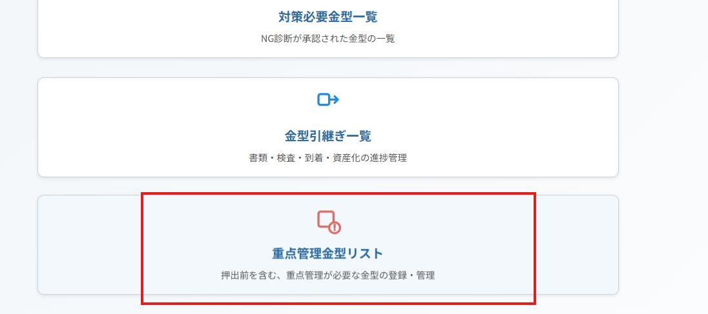
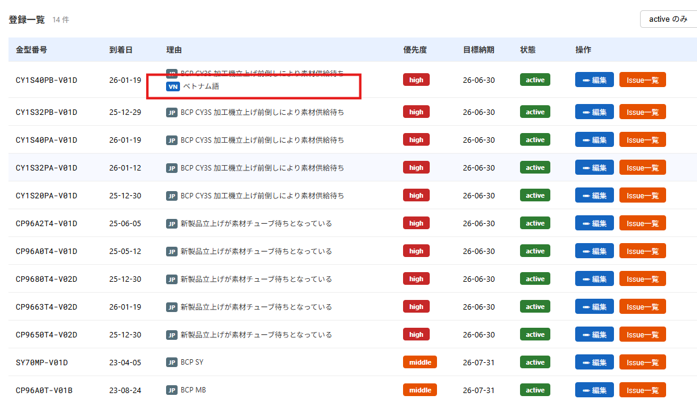
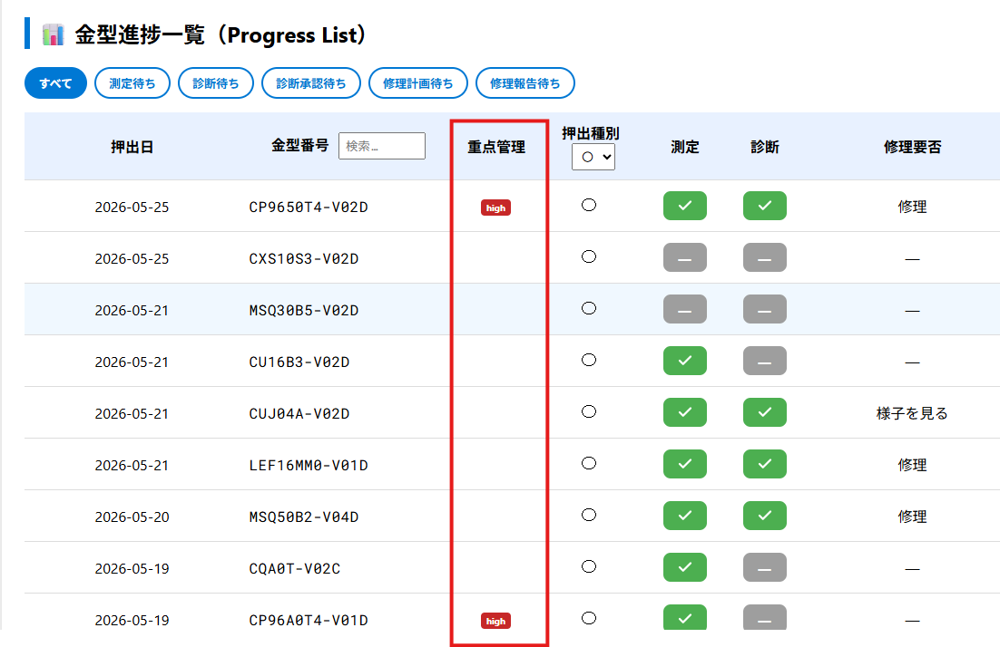

# 2026/05/26

### 修正1

承認できる時のパスワード
1031/6767/5375
の3つ。

---

### 修正２

「重点管理金型」リストの、ベトナム語表記の追加。※VN後が入っていないところは入力してください。

<figure style="text-align:center;">
  
  <!-- <figcaption>測定進捗追加</figcaption> -->
</figure>

<figure style="text-align:center;">
  
  <!-- <figcaption>測定進捗追加</figcaption> -->
</figure>

---

### 修正３

管理対象になっている金型は、表記する。まだ、移管状態が反映できない。

<figure style="text-align:center;">
  
  <!-- <figcaption>測定進捗追加</figcaption> -->
</figure>

---

# 2026/05/26

### Sửa đổi 1

Mật khẩu có thể được sử dụng để phê duyệt:
1031 / 6767 / 5375
(tổng cộng 3 loại).

---

### Sửa đổi 2

Bổ sung hiển thị tiếng Việt. ※ Những phần chưa có nội dung sau "VN" vui lòng nhập bổ sung.

<figure style="text-align:center;">
  
  <!-- <figcaption>測定進捗追加</figcaption> -->
</figure>

<figure style="text-align:center;">
  
  <!-- <figcaption>測定進捗追加</figcaption> -->
</figure>

---

### Sửa đổi 3

Các khuôn thuộc đối tượng quản lý sẽ được hiển thị. Hiện tại, trạng thái chuyển giao vẫn chưa thể phản ánh.

<figure style="text-align:center;">
  
  <!-- <figcaption>測定進捗追加</figcaption> -->
</figure>
``
