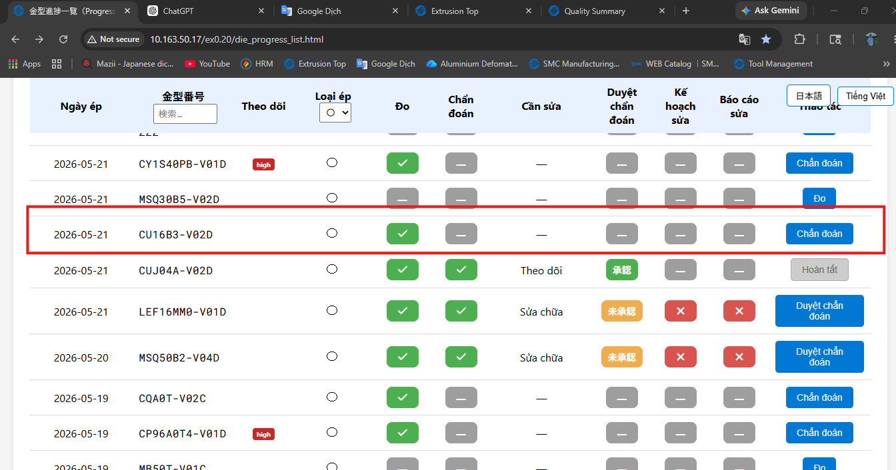
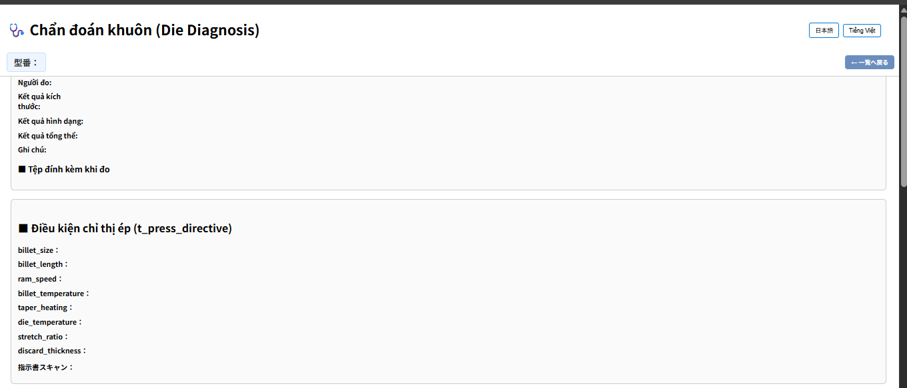
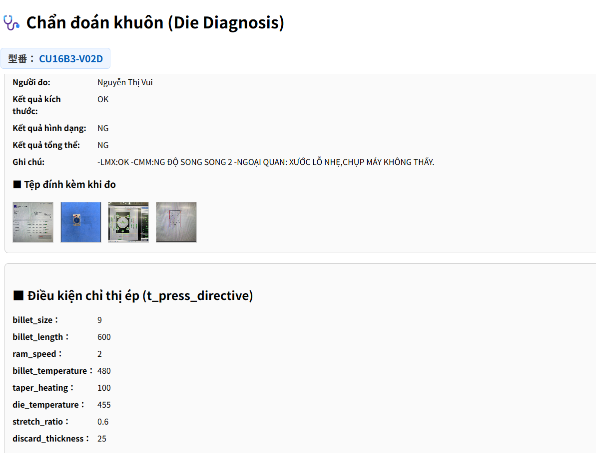

# 2026/05/27

---

### 不具合

診断画面で、測定結果が表示されません。

<figure style="text-align:center;">
  
  <!-- <figcaption>測定進捗追加</figcaption> -->
</figure>
<figure style="text-align:center;">
  
  <!-- <figcaption>測定進捗追加</figcaption> -->
</figure>

### 解決

原因、診断モード画面を開くとき、「新規作成モードで開いてしまった」

<figure style="text-align:center;">
  
  <!-- <figcaption>測定進捗追加</figcaption> -->
</figure>

---

### Sự cố

Trên màn hình chẩn đoán, kết quả đo không được hiển thị.

<figure style="text-align:center;">
  
  <!-- <figcaption>測定進捗追加</figcaption> -->
</figure>

<figure style="text-align:center;">
  
  <!-- <figcaption>測定進捗追加</figcaption> -->
</figure>

---

### Cách khắc phục

Nguyên nhân: Khi mở màn hình chế độ chẩn đoán, hệ thống đã mở ở chế độ tạo mới.

<figure style="text-align:center;">
  
  <!-- <figcaption>測定進捗追加</figcaption> -->
</figure>
