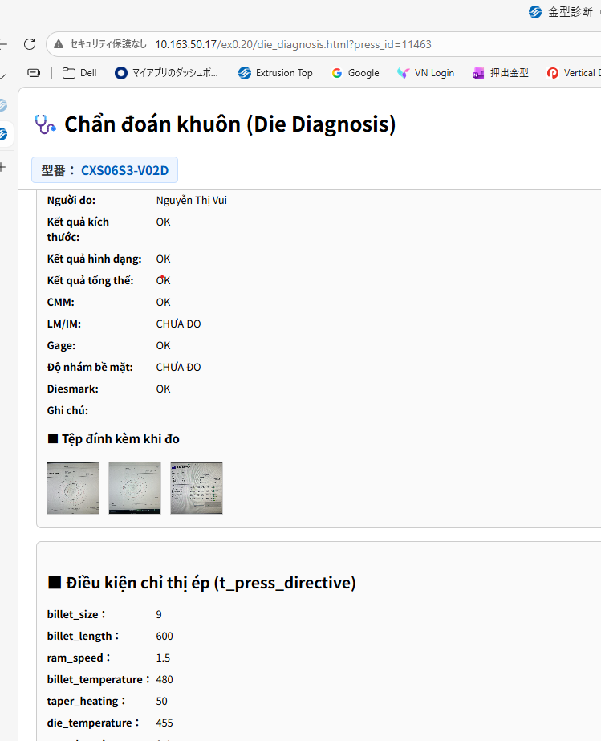

#　Webシステムの問題について

### 問題と対応

昨日、動作確認をしていたところ、一つ問題が発見されました。それは、下図、金型診断画面のページで、金型によっては、承認時にエラーが出ます。

<figure style="text-align:center;">
  
  <!-- <figcaption>測定進捗追加</figcaption> -->
</figure>

現在問題を調査中ですが、今日は復旧できません。申し訳ないですが、承認できない場合、来週、承認してください。

# Về sự cố của hệ thống Web

### Vấn đề và cách xử lý

Hôm qua, trong quá trình kiểm tra hoạt động, chúng tôi đã phát hiện một vấn đề. Cụ thể là, trên trang màn hình chẩn đoán khuôn (hình dưới đây), đối với một số khuôn, khi thực hiện phê duyệt sẽ xảy ra lỗi.

<figure style="text-align:center;">
  
  <!-- <figcaption>測定進捗追加</figcaption> -->
</figure>

Hiện tại chúng tôi đang tiến hành điều tra nguyên nhân của sự cố, tuy nhiên hôm nay chưa thể khắc phục được. Rất mong được thông cảm, nếu không thể phê duyệt, vui lòng thực hiện phê duyệt vào tuần sau.
