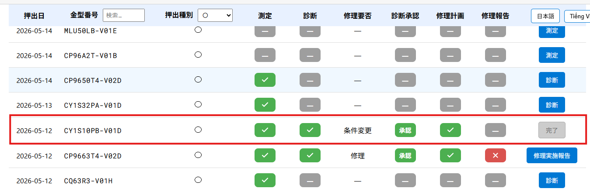
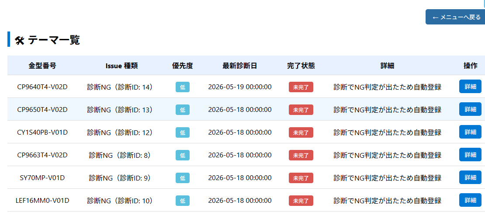
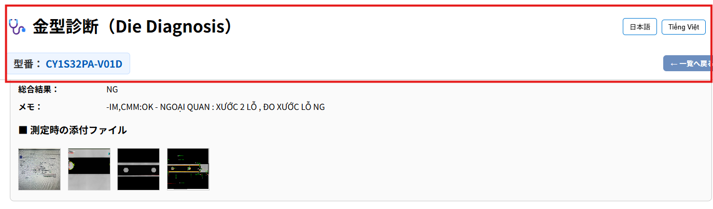

### 修正点１

診断時、「修理しない」と判断した場合、承認されると、「完了」となる。

> 将来「完了」となったものは、各工程を一覧表示するページを作る予定。

<figure style="text-align:center;">
  
  <!-- <figcaption>測定進捗追加</figcaption> -->
</figure>

### 修正点２

診断時「修理しない」金型で、移管されていない金型は、以下リストに追加される。

<figure style="text-align:center;">
  
  <!-- <figcaption>測定進捗追加</figcaption> -->
</figure>

### 修正点３

診断、承認画面の上部（下図赤枠部）の表示を固定。

<figure style="text-align:center;">
  
  <!-- <figcaption>測定進捗追加</figcaption> -->
</figure>

### その他注意点

診断の承認モードで、「承認」した場合の動きの確認が不十分です。問題が有るときは連絡してください。

---

### Điểm sửa đổi 1

Trong quá trình chẩn đoán, nếu kết quả là “không cần sửa chữa”, sau khi được phê duyệt thì trạng thái sẽ chuyển sang “hoàn thành”.

> Trong tương lai, đối với các trường hợp đã “hoàn thành”, sẽ phát triển trang hiển thị danh sách từng công đoạn.

<figure style="text-align:center;">
  
  <!-- <figcaption>Bổ sung tiến độ đo lường</figcaption> -->
</figure>

### Điểm sửa đổi 2

Đối với các khuôn được chẩn đoán là “không cần sửa chữa” nhưng chưa được chuyển giao, sẽ được thêm vào danh sách dưới đây.

<figure style="text-align:center;">
  
  <!-- <figcaption>Bổ sung tiến độ đo lường</figcaption> -->
</figure>

### Điểm sửa đổi 3

Cố định phần hiển thị phía trên của màn hình chẩn đoán và phê duyệt (phần khung đỏ trong hình dưới).

<figure style="text-align:center;">
  
  <!-- <figcaption>Bổ sung tiến độ đo lường</figcaption> -->
</figure>

### Lưu ý khác

Việc kiểm tra hoạt động khi chọn “phê duyệt” trong chế độ phê duyệt chẩn đoán vẫn chưa đầy đủ. Nếu có vấn đề, vui lòng liên hệ.
