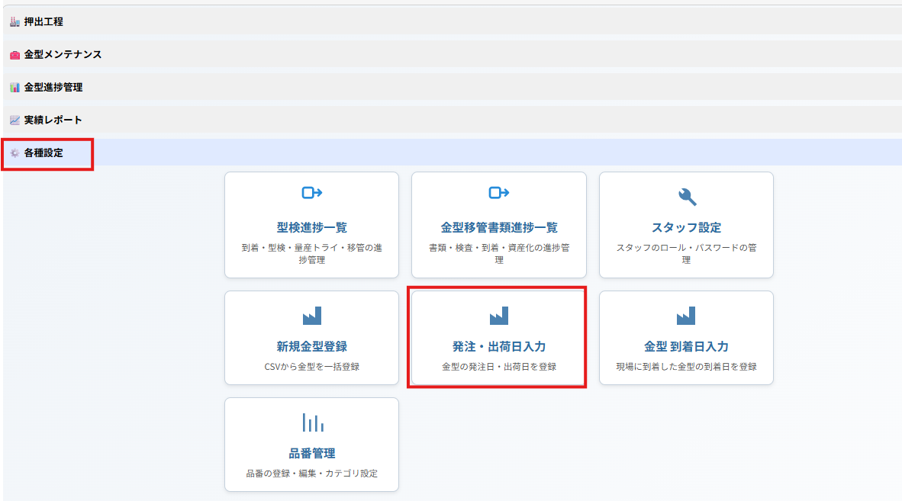
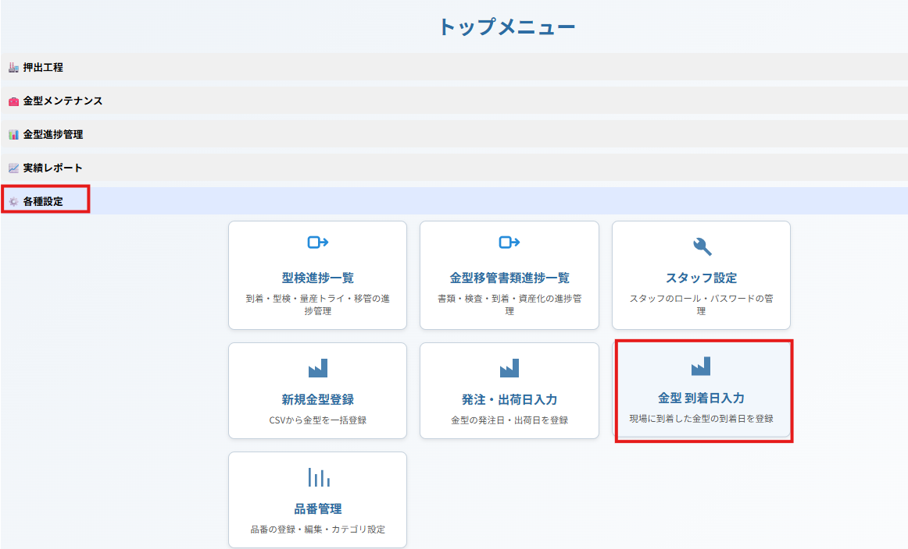
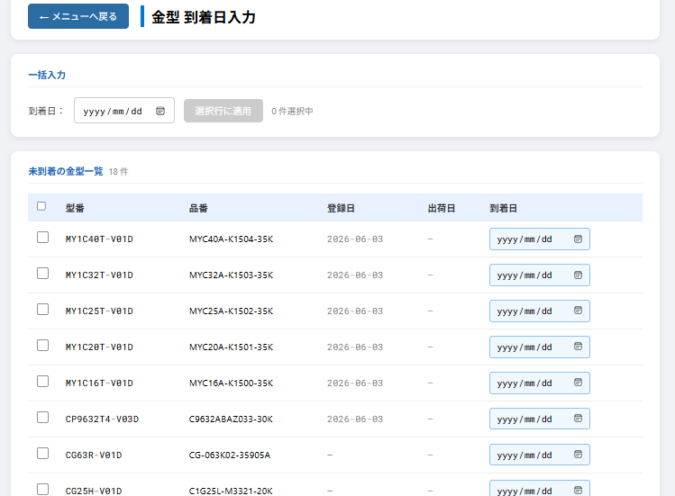
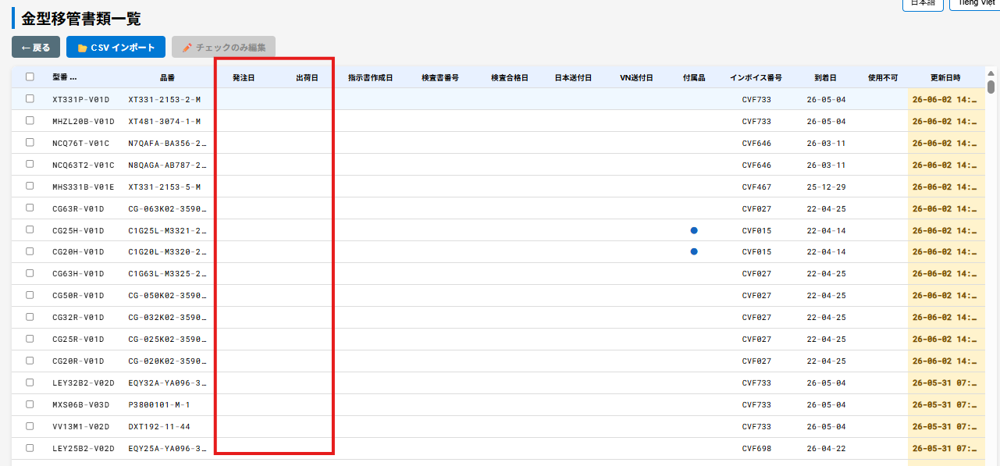
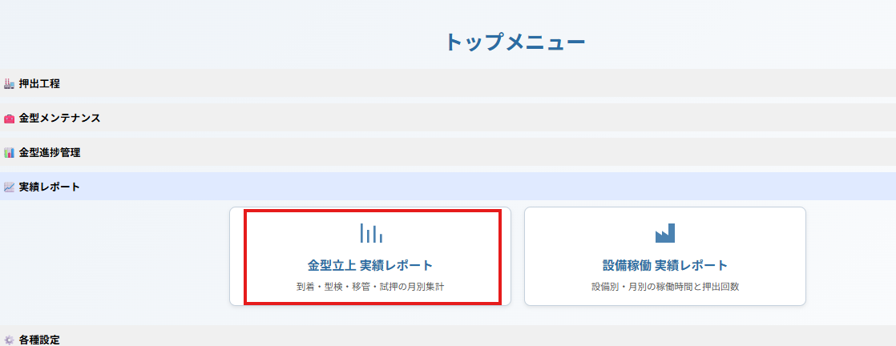
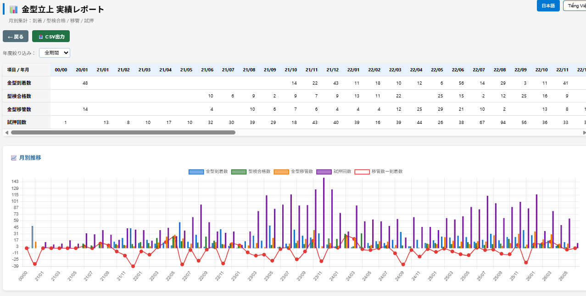
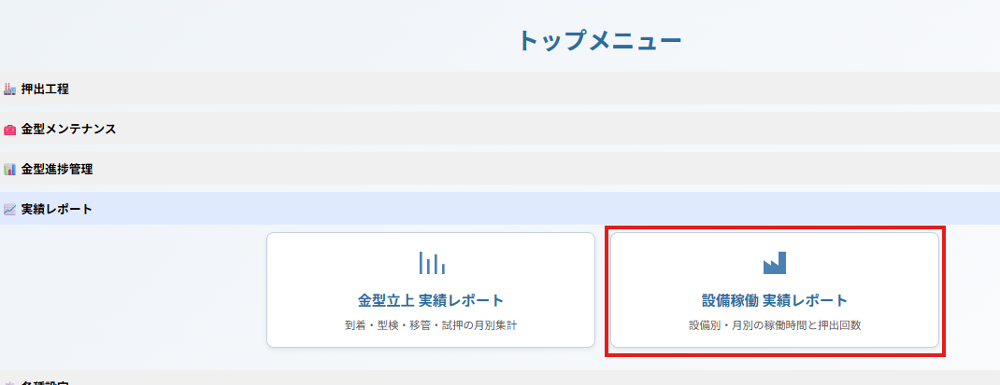
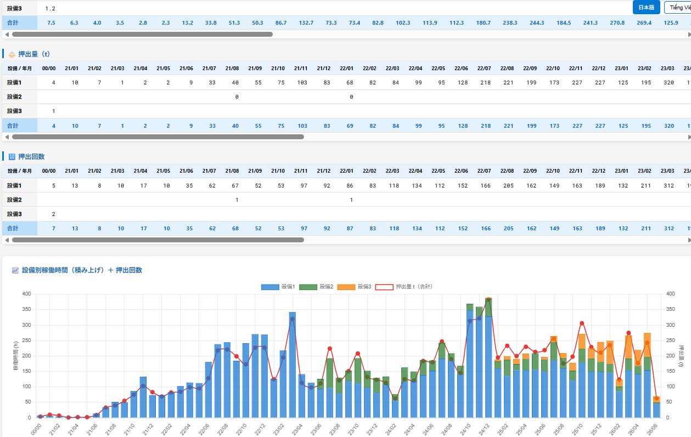

# 変更ログ（2026-06-07）

## 1\. 発注・出荷日入力画面 新規追加（日本側業務）

**対象ファイル**

- `die\_order.html`
- `php/die\_order/get\_pending.php`
- `php/die\_order/save.php`

<figure style="text-align:center;">
  
  <!-- <figcaption>測定進捗追加</figcaption> -->
</figure>

**DB 変更**

```sql
ALTER TABLE t\_die\_handover
  ADD COLUMN ordered\_at DATE NULL COMMENT '発注日',
  ADD COLUMN shipped\_at DATE NULL COMMENT '出荷日';
```

**内容**

- 発注待ち金型を一覧表示（型番・品番・発注日・出荷日）
- 型番検索・一括日付入力対応
- テーブルエリアに最大高さ制限＋スクロールを追加

\---

## 2\. 金型到着日入力画面 新規追加（ベトナム側業務）

到着した金型の登録画面。**到着日だけ入力**。

**対象ファイル**

- `die\_arrival.html`
- `php/die\_arrival/get\_pending\_dies.php`
- `php/die\_arrival/save\_arrival.php`

<figure style="text-align:center;">
  
  <!-- <figcaption>測定進捗追加</figcaption> -->
</figure>

<figure style="text-align:center;">
  
  <!-- <figcaption>測定進捗追加</figcaption> -->
</figure>

**内容**

- 到着予定（未到着）の金型を一覧表示
- 一括日付入力に対応
- 到着日を `m\_dies`・`t\_die\_handover`・`t\_die\_handover\_progress` の3テーブルに同時保存

\---

## 3\. handover_list.html — 発注日・出荷日列追加・レイアウト変更

Nguyenさん担当画面

**内容**

- 「発注日」「出荷日」列を追加
- 型番列を左固定（sticky）に変更
- 列数増加に伴い横スクロールを有効化

<figure style="text-align:center;">
  
  <!-- <figcaption>測定進捗追加</figcaption> -->
</figure>

**対象ファイル**

- `handover\_list.html`
- `php/handover/get\_die\_handover\_list.php`
- `php/handover/update\_die\_handover.php`

\---

## 4\. die_import.html — タイトル変更

**内容**

- 画面タイトルを「金型インポート」→「新規金型登録」に変更

\---

## 5\. index.html — カード追加・名称変更

**内容**

- 新規カードを追加：「発注・出荷日入力（`die\_order.html`）」「到着日入力（`die\_arrival.html`）」
- 「金型インポート」→「新規金型登録」に名称変更

## 6.その他：金型立上げ、実績レポート画面追加

**内容**
毎月の、
・金型到着数
・型検合格数
・金型移管数
・試押回数
を集計。未移管金型の管理を目的とした。どんな数字が欲しいか、意見が欲しい。

<figure style="text-align:center;">
  
  <!-- <figcaption>測定進捗追加</figcaption> -->
</figure>

<figure style="text-align:center;">
  
  <!-- <figcaption>測定進捗追加</figcaption> -->
</figure>

\---

### 管理指標の提案

- 未移管金型数（滞留数）
- 到着から移管完了までの平均日数
- 型検NG率
- 試押平均回数
- 月別移管完了率
- 30日以上未移管の金型件数
- 工場別・担当者別の処理件数
- 新規金型登録数と移管完了数の比較

\---

## 7.その他：

**内容**
毎月の、押出量を設備別に集計グラフ化。

<figure style="text-align:center;">
  
  <!-- <figcaption>測定進捗追加</figcaption> -->
</figure>

<figure style="text-align:center;">
  
  <!-- <figcaption>測定進捗追加</figcaption> -->
</figure>

\---

# Nhật ký thay đổi（2026-06-07）

## 1\. Thêm mới màn hình nhập ngày đặt hàng・ngày xuất hàng

**File liên quan**

- `die\_order.html`
- `php/die\_order/get\_pending.php`
- `php/die\_order/save.php`

<figure style="text-align:center;">
  
  <!-- <figcaption>測定進捗追加</figcaption> -->
</figure>

**Thay đổi DB**

```sql
ALTER TABLE t\_die\_handover
  ADD COLUMN ordered\_at DATE NULL COMMENT '発注日',
  ADD COLUMN shipped\_at DATE NULL COMMENT '出荷日';
```

**Nội dung**

- Hiển thị danh sách khuôn đang chờ đặt hàng（mã khuôn, số sản phẩm, ngày đặt hàng, ngày xuất hàng）
- Hỗ trợ tìm kiếm theo mã khuôn và nhập ngày hàng loạt
- Thêm giới hạn chiều cao tối đa và cuộn cho khu vực bảng

\---

## 2\. Thêm mới màn hình nhập ngày đến khuôn

Màn hình dùng để đăng ký khuôn đã đến. **Chỉ nhập ngày đến**.

**File liên quan**

- `die\_arrival.html`
- `php/die\_arrival/get\_pending\_dies.php`
- `php/die\_arrival/save\_arrival.php`

<figure style="text-align:center;">
  
  <!-- <figcaption>測定進捗追加</figcaption> -->
</figure>

<figure style="text-align:center;">
  
  <!-- <figcaption>測定進捗追加</figcaption> -->
</figure>

**Nội dung**

- Hiển thị danh sách khuôn dự kiến đến（chưa đến）
- Hỗ trợ nhập ngày hàng loạt
- Lưu ngày đến đồng thời vào 3 bảng: `m\_dies`・`t\_die\_handover`・`t\_die\_handover\_progress`

\---

## 3\. handover_list.html — Thêm cột ngày đặt hàng・ngày xuất hàng・thay đổi bố cục

Màn hình phụ trách bởi Nguyen-san.

**Nội dung**

- Thêm cột「Ngày đặt hàng」và「Ngày xuất hàng」
- Cố định cột mã khuôn bên trái（sticky）
- Bật cuộn ngang do số lượng cột tăng

<figure style="text-align:center;">
  
  <!-- <figcaption>測定進捗追加</figcaption> -->
</figure>

**File liên quan**

- `handover\_list.html`
- `php/handover/get\_die\_handover\_list.php`
- `php/handover/update\_die\_handover.php`

\---

## 4\. die_import.html — Đổi tiêu đề

**Nội dung**

- Đổi tiêu đề màn hình từ「金型インポート」thành「新規金型登録」（Đăng ký khuôn mới）

\---

## 5\. index.html — Thêm card・Đổi tên

**Nội dung**

- Thêm card mới:
  - 「Nhập ngày đặt hàng・xuất hàng（`die\_order.html`）」
  - 「Nhập ngày đến（`die\_arrival.html`）」

- Đổi tên「金型インポート」thành「新規金型登録」

\---

## 6\. Khác：Thêm màn hình báo cáo thực績・triển khai khuôn

**Nội dung**

Tổng hợp theo tháng:

- Số lượng khuôn đã đến
- Số lượng pass kiểm tra khuôn
- Số lượng khuôn đã bàn giao
- Số lần thử ép

Mục đích là quản lý các khuôn chưa bàn giao và theo dõi tiến độ triển khai.

<figure style="text-align:center;">
  
  <!-- <figcaption>測定進捗追加</figcaption> -->
</figure>

<figure style="text-align:center;">
  
  <!-- <figcaption>測定進捗追加</figcaption> -->
</figure>

### Đề xuất chỉ số quản lý

- Số lượng khuôn chưa bàn giao
- Số ngày trung bình từ khi khuôn đến đến khi bàn giao
- Tỷ lệ NG kiểm tra khuôn
- Số lần thử ép trung bình
- Tỷ lệ hoàn thành bàn giao theo tháng
- Số khuôn chưa bàn giao quá 30 ngày
- Số lượng xử lý theo nhà máy / người phụ trách
- So sánh số lượng đăng ký khuôn mới và số lượng hoàn thành bàn giao

\---

## 7\. Khác：

**Nội dung**

Tổng hợp và hiển thị biểu đồ sản lượng ép đùn theo từng thiết bị theo tháng.

<figure style="text-align:center;">
  
  <!-- <figcaption>測定進捗追加</figcaption> -->
</figure>

<figure style="text-align:center;">
  
  <!-- <figcaption>測定進捗追加</figcaption> -->
</figure>
