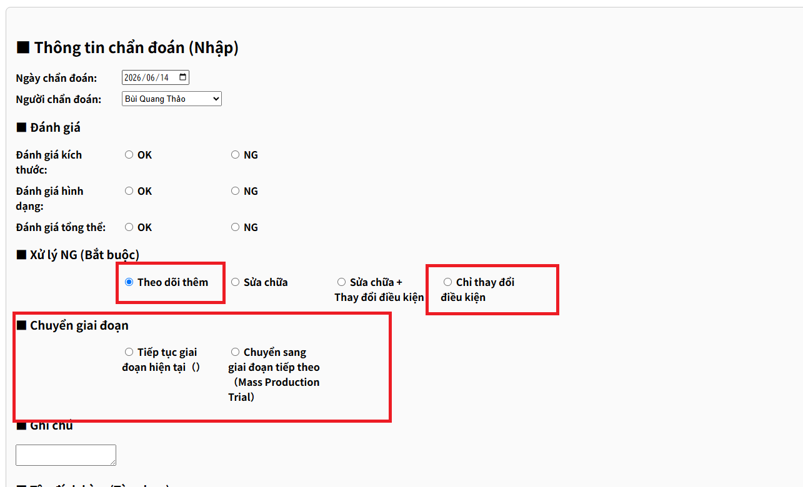
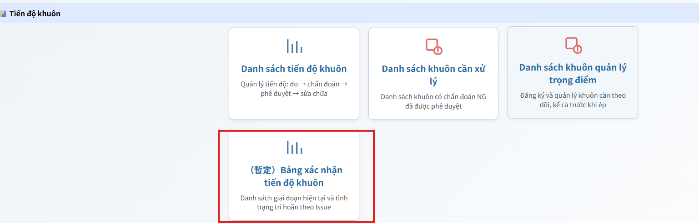
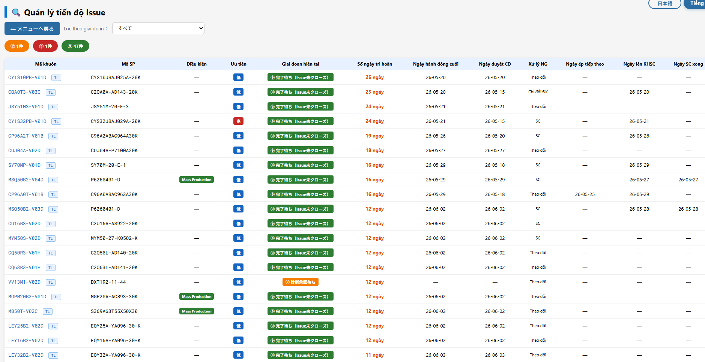

# die_issue_progress.html 新設の背景

---

## 1. die_progress_list.html が管理していた範囲

金型のサイクル「押出→評価→診断」、**プロセスの記録**に特化した管理。

| ステップ      | 内容                                           |
| ------------- | ---------------------------------------------- |
| Issue 登録    | 金型に発生した課題を登録                       |
| 診断 実施     | 修理が必要か、コンディション変更が必要かを診断 |
| 診断 承認     | 上長が診断内容を承認                           |
| 修理計画 承認 | 修理が必要な場合、修理計画を承認               |
| 修理 実施     | 実際の修理作業                                 |
| 修理報告 承認 | 修理完了を承認                                 |
| 次押出        | 修理後または条件変更後の試し押出               |

**問題点**

試押で修理が必要ないと判断した金型は、試押→量産試押→量産と進む必要がある。

- `試押` → `量産試押` → `量産` の順に昇格
- `試押`金型が診断で「コンディション UP」が承認されると、修理は不要のため**量試押出**に進む

**今回の改造：`die_diagnosis.html` へのフェーズ移行（`試押` → `量産試押`）ボタン追加**

診断画面にフェーズ移行ボタンを追加した。(修理が必要ないと判断した時に表示される)

<figure style="text-align:center;">
  
  <!-- <figcaption>測定進捗追加</figcaption> -->
</figure>

---

## 2. 型検進捗の管理

上記で、次のフェーズへ移行を選択し、承認された金型の品質評価の進捗確認画面。

<figure style="text-align:center;">
  
  <!-- <figcaption>測定進捗追加</figcaption> -->
</figure>

<figure style="text-align:center;">
  
  <!-- <figcaption>測定進捗追加</figcaption> -->
</figure>

---

## 3. 課題：何が見えていなかったか

上記 2 つの管理は**別々のページ・別々の担当者**で運用されていた。

そのため、次のことが確認できていなかった。

- コンディション ステージUP が承認された後、**実際に次押出が実施されたか**
- 次押出が完了した後、**型検プロセスが開始されたか**
- 型検の各ステップが**どこで止まっているか**

> つまり「プロセスの**記録**はできていたが、プロセスの**結果**が出ているかが見えていなかった」
